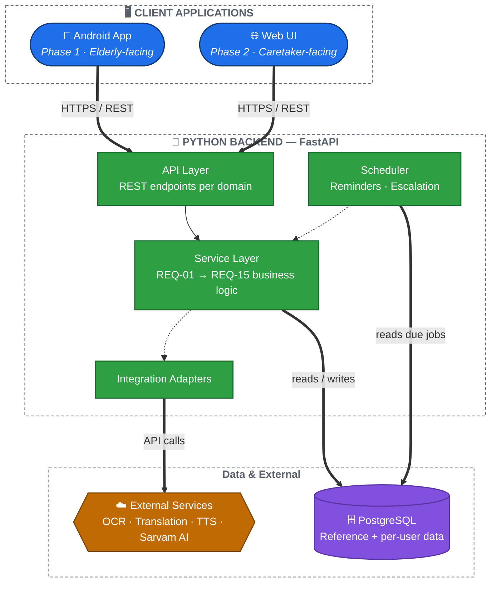

# ARCH-00 — Overview

Status: Approved

## Introduction

### The problem

Elderly patients are frequently prescribed multiple medications, often by different doctors, filled at different pharmacies, under different brand names for the same active ingredient. In practice this leads to well-documented, dangerous failure modes: taking two products that are chemically the same drug under different names (accidental double-dosing), missing doses because a schedule was never written down anywhere durable, running out of a medication because no one was tracking the purchased quantity against how fast it's consumed, or continuing to take something past its expiry date because nobody checked. Printed packaging and prescriptions also assume literacy and eyesight that not every elderly patient has, and India in particular adds a language dimension — a prescription or label in English or in unfamiliar terminology is often not something the patient can act on unassisted.

None of this is solved by a single feature. It requires something that can reliably *read* what's in front of the patient (a pill, a handwritten prescription, a pharmacy receipt), *understand* it well enough to reason about chemical identity rather than brand names, *remember* what it has learned across separate, out-of-order interactions, and *act* on that memory safely — nagging, warning, or reminding only when it actually has enough information to do so responsibly.

### What Med-Verify does about it

Med-Verify is a scan-first assistant built around three independent input types, detailed in [Requirements/](../Requirements/README.md):

- **Medicine** — scanning a pill, strip, or packaging identifies it by active chemical ingredient (not just brand), reads the label back in large on-screen text and in the patient's own local language via translated audio, and suggests a standard elderly-appropriate dosage.
- **Prescription** — scanning a doctor's prescription extracts what medicine, how much, and how often, and turns that into intake reminders that run until the prescribed course ends.
- **Pharmacy Bill** — scanning a purchase receipt extracts the medicine and quantity bought, and — combined with whatever dosage information is already known — sets up a refill reminder ahead of running out.

Critically, these three scans are not required to happen together, or in any particular order. A caretaker might scan only a pharmacy bill today and the matching prescription weeks later; the system is expected to recognize both refer to the same medicine (by chemical identity, regardless of brand) and upgrade its earlier best-effort conclusions once the better information shows up. That persistence-and-correction behavior, not any single scan, is the hardest and most central requirement in the whole system ([REQ-00](../Requirements/REQ-00-behavior-model.md)) — and the main reason this document set exists.

Beyond the three core scans, the product also actively watches for danger rather than just answering when asked: it warns when two of a patient's medicines are chemically the same or interact ([REQ-12](../Requirements/REQ-12-duplicate-interaction-warning.md)), refuses to suggest a dosage for an expired medicine and tells the patient to replace it instead ([REQ-14](../Requirements/REQ-14-expiry-date-check.md)), and escalates to a caretaker — by SMS and, from Phase 2, a real-time Web UI alert — if scheduled doses are repeatedly missed ([REQ-13](../Requirements/REQ-13-missed-dose-escalation.md)).

### Who it's for, and how setup works

The elderly patient is the app's only day-to-day user, and is deliberately kept out of every piece of complexity that isn't the scan itself: no login, no account recovery, no settings to misconfigure, no denser "advanced" screen to accidentally wander into ([REQ-11](../Requirements/REQ-11-simplified-ui-mode.md)). A caretaker — a family member, typically — performs the one-time setup: creating the account, scanning the patient's existing prescriptions and bills, and registering an emergency contact for escalation ([REQ-15](../Requirements/REQ-15-assisted-onboarding.md)). From Phase 2 onward, that same caretaker gets a separate, more capable Web UI to manage things on an ongoing basis — adding medicines, reviewing adherence history, responding to escalation alerts — without that complexity ever leaking into the elderly user's app ([REQ-10](../Requirements/REQ-10-caretaker-web-dashboard.md)).

### Roadmap

**Phase 1** ships the Android app and the backend behind it: all three scan types, dosage suggestions, intake and refill reminders, the safety checks (duplicate/interaction, expiry), and SMS-based escalation. **Phase 2** adds the caretaker Web UI, real-time escalation alerts to it, and an AI chat box for follow-up questions, prioritizing Indian-language-first models such as Sarvam AI over generic Western LLMs, since local-language support is core to the product, not an afterthought ([REQ-09](../Requirements/REQ-09-ai-chat-followup.md)).

### Why the architecture looks the way it does

Three properties of the product above drove the technical decisions that follow, more than anything else:

- **Elderly-first, caretaker-assisted** means the Android app must stay radically simple, which in turn means it can't be where the real complexity lives — that complexity has to live somewhere else, reachable from a second, separate client.
- **State persists and self-corrects across independent scans** means whatever holds that state has to be a single, consistent source of truth that both the Android app and the future Web UI can see and act on identically — not two separate copies of the truth that could drift apart.
- **Safety-relevant by nature** means dosage logic, chemical-identity matching, interaction/expiry checks, and escalation rules need to be implemented once, correctly, and tested in isolation — not duplicated across clients where the same bug would have to be fixed twice.

Put together, these three properties are what point this architecture toward a central backend holding all of the logic and data, with both the Android app and the Web UI as clients against it — covered in detail below.

## The shape of the system

Two things drove this architecture more than anything else:

1. **Two frontends need the same evolving data.** [REQ-00](../Requirements/REQ-00-behavior-model.md) requires the app to remember everything it learns per user/medicine, across independent scans, and update conclusions (like refill reminders) as new information arrives. [REQ-10](../Requirements/REQ-10-caretaker-web-dashboard.md) requires a caretaker to see and manage that same data from a separate Web UI in Phase 2. Two clients needing one consistent, evolving state means there must be a single source of truth they both talk to — not each client keeping its own copy of the data and logic.
2. **Python was chosen for easy AI integration** ([REQ-09](../Requirements/REQ-09-ai-chat-followup.md), prioritizing Sarvam AI). A Python backend is the natural home for that, and for the OCR/translation/TTS work in REQ-03/REQ-05.

Together, this points to a classic **client-server architecture with a central backend**, rather than putting the REQ-01–REQ-15 business logic on-device.

## High-level diagram

🔵 Client apps · 🟢 Backend services · 🟣 Data layer · 🟠 External integrations

Reminder delivery (Scheduler → Android, in-app push) is intentionally omitted from this diagram to keep the top-to-bottom flow clean — it's a background/async path fully diagrammed in [ARCH-05](ARCH-05-flows.md)'s reminder & escalation sequence.

## Why not put logic on-device?

Early requirement notes (REQ-02) mentioned a "local SQLite database" for the brand→chemical lookup, which reads like an on-device, offline-first design. That's a reasonable instinct for elderly users with unreliable connectivity, but it doesn't hold up once REQ-10's caretaker web dashboard enters the picture — duplicating REQ-01–REQ-15's logic and data in two places (on-device and on a future server) would mean solving cross-client consistency twice, or migrating everything later. Centralizing now avoids that rework. Offline resilience is instead handled by the Android app caching recent data locally (see [ARCH-01](ARCH-01-components.md)), not by owning the source of truth.

## What lives where

| Concern | Lives in |
|---|---|
| Business logic (REQ-01–REQ-15) | Backend service layer |
| Source-of-truth data (accounts, reference data, scans, reminders) | Backend, PostgreSQL |
| UI rendering, camera capture, TTS playback | Clients (Android, Web) |
| Local cache for offline resilience | Android app only |
| Scheduling reminders/escalation | Backend scheduler |

See [ARCH-01](ARCH-01-components.md) for the component breakdown, [ARCH-02](ARCH-02-authentication.md) for how clients authenticate, [ARCH-03](ARCH-03-data-model.md) for the data model, [ARCH-04](ARCH-04-deployment.md) for deployment, and [ARCH-05](ARCH-05-flows.md) for concrete request flows.

## Open questions

- Exact offline scope for the Android app (what specifically must work with no connectivity) is not yet defined — affects how much local caching logic is needed.
- Choice of specific OCR/translation/TTS vendors is deferred (per REQ-03/REQ-05); the adapter pattern in ARCH-01 exists specifically so this choice doesn't ripple through the service layer.
