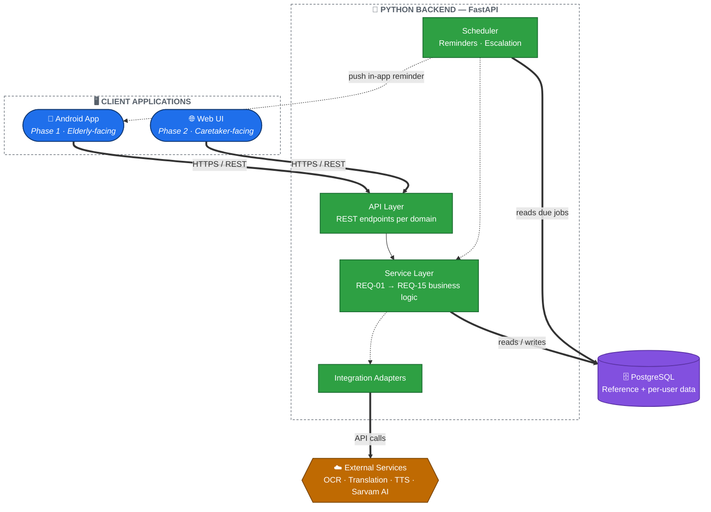

# ARCH-00 — Overview

Status: Draft — pending review

## The shape of the system

Two things drove this architecture more than anything else:

1. **Two frontends need the same evolving data.** [REQ-00](../Requirements/REQ-00-behavior-model.md) requires the app to remember everything it learns per user/medicine, across independent scans, and update conclusions (like refill reminders) as new information arrives. [REQ-10](../Requirements/REQ-10-caretaker-web-dashboard.md) requires a caretaker to see and manage that same data from a separate Web UI in Phase 2. Two clients needing one consistent, evolving state means there must be a single source of truth they both talk to — not each client keeping its own copy of the data and logic.
2. **Python was chosen for easy AI integration** ([REQ-09](../Requirements/REQ-09-ai-chat-followup.md), prioritizing Sarvam AI). A Python backend is the natural home for that, and for the OCR/translation/TTS work in REQ-03/REQ-05.

Together, this points to a classic **client-server architecture with a central backend**, rather than putting the REQ-01–REQ-15 business logic on-device.

## High-level diagram

🔵 Client apps · 🟢 Backend services · 🟣 Data layer · 🟠 External integrations

## Why not put logic on-device?

Early requirement notes (REQ-02) mentioned a "local SQLite database" for the brand→chemical lookup, which reads like an on-device, offline-first design. That's a reasonable instinct for elderly users with unreliable connectivity, but it doesn't hold up once REQ-10's caretaker web dashboard enters the picture — duplicating REQ-01–REQ-15's logic and data in two places (on-device and on a future server) would mean solving cross-client consistency twice, or migrating everything later. Centralizing now avoids that rework. Offline resilience is instead handled by the Android app caching recent data locally (see [ARCH-01](ARCH-01-components.md)), not by owning the source of truth.

## What lives where

| Concern | Lives in |
|---|---|
| Business logic (REQ-01–REQ-15) | Backend service layer |
| Source-of-truth data (accounts, reference data, scans, reminders) | Backend, PostgreSQL |
| UI rendering, camera capture, TTS playback | Clients (Android, Web) |
| Local cache for offline resilience | Android app only |
| Scheduling reminders/escalation | Backend scheduler |

See [ARCH-01](ARCH-01-components.md) for the component breakdown, [ARCH-02](ARCH-02-authentication.md) for how clients authenticate, [ARCH-03](ARCH-03-data-model.md) for the data model, [ARCH-04](ARCH-04-deployment.md) for deployment, and [ARCH-05](ARCH-05-flows.md) for concrete request flows.

## Open questions

- Exact offline scope for the Android app (what specifically must work with no connectivity) is not yet defined — affects how much local caching logic is needed.
- Choice of specific OCR/translation/TTS vendors is deferred (per REQ-03/REQ-05); the adapter pattern in ARCH-01 exists specifically so this choice doesn't ripple through the service layer.
