# ARCH-03 — Data Model

Status: Approved

## Overview

PostgreSQL holds two kinds of data:

- **Reference data** — shared, mostly-static: medicines, their chemical components, standard/elderly dosages, known interactions. Sourced from a local dataset with an online fallback that gets cached back in ([REQ-02](../Requirements/REQ-02-medicine-identification.md), [REQ-04](../Requirements/REQ-04-dosage-suggestion.md)).
- **Per-user data** — everything the app learns about a specific patient across independent scans ([REQ-00](../Requirements/REQ-00-behavior-model.md)): their medicines, prescriptions, bills, reminders, adherence, escalation contacts, pending-review scans, and caretaker overrides ([REQ-17](../Requirements/REQ-17-caretaker-review-and-override.md)).

`ACCOUNT` below is the **elderly user's** account (created at REQ-15 onboarding, Phase 1). `CARETAKER_ACCOUNT` is a separate identity (Phase 2, [REQ-16](../Requirements/REQ-16-caretaker-multi-patient-linking.md)) linked to one or more `ACCOUNT` rows via `CARETAKER_LINK` — this is what lets one caretaker manage several elderly users from a single login.

## Entity overview

```mermaid
erDiagram
    %% -- Account & access -----------------------------------------
    ACCOUNT ||--o{ SESSION : has
    ACCOUNT ||--o{ ESCALATION_CONTACT : has
    ACCOUNT ||--o{ USER_MEDICINE : tracks

    %% -- Caretaker accounts & linking (Phase 2, REQ-16) ------------
    CARETAKER_ACCOUNT ||--o{ CARETAKER_LINK : links
    ACCOUNT ||--o{ CARETAKER_LINK : "linked by"

    %% -- Caretaker review & override (Phase 2, REQ-17) -------------
    ACCOUNT ||--o{ SCAN_ARTIFACT : has
    USER_MEDICINE ||--o{ SCAN_ARTIFACT : "resolved into"
    CARETAKER_ACCOUNT ||--o{ SCAN_ARTIFACT : resolves
    USER_MEDICINE ||--o{ DOSAGE_OVERRIDE : "overridden by"
    CARETAKER_ACCOUNT ||--o{ DOSAGE_OVERRIDE : sets
    USER_MEDICINE ||--o{ PRESCRIPTION_CONFLICT_REVIEW : raises
    CARETAKER_ACCOUNT ||--o{ PRESCRIPTION_CONFLICT_REVIEW : decides

    %% -- Reference data (shared, mostly-static) --------------------
    CHEMICAL_COMPONENT ||--o{ MEDICINE_COMPONENT : "part of"
    MEDICINE ||--o{ MEDICINE_COMPONENT : has
    MEDICINE ||--o{ USER_MEDICINE : "identified as"

    %% -- Per-user data, anchored on USER_MEDICINE ------------------
    USER_MEDICINE ||--o{ PRESCRIPTION_ITEM : "dosage from"
    USER_MEDICINE ||--o{ BILL_ITEM : "purchase of"
    USER_MEDICINE ||--o{ REMINDER : schedules
    USER_MEDICINE ||--o{ INTERACTION_WARNING : "flagged in"

    %% -- Adherence & escalation trail -------------------------------
    REMINDER ||--o{ ADHERENCE_LOG : records
    REMINDER ||--o{ ESCALATION_EVENT : triggers

    ACCOUNT {
        uuid id
        string username
        string password_hash
        datetime created_at
    }
    SESSION {
        uuid id
        uuid account_id
        string refresh_token_hash
        datetime expires_at
    }
    CARETAKER_ACCOUNT {
        uuid id
        string username
        string password_hash
        datetime created_at
    }
    CARETAKER_LINK {
        uuid id
        uuid caretaker_account_id
        uuid account_id
        string status
        datetime linked_at
    }
    MEDICINE {
        uuid id
        string brand_name
        date printed_expiry_date
        string source
    }
    CHEMICAL_COMPONENT {
        uuid id
        string name
    }
    MEDICINE_COMPONENT {
        uuid medicine_id
        uuid chemical_component_id
    }
    USER_MEDICINE {
        uuid id
        uuid account_id
        uuid medicine_id
        string origin_scan_type
        datetime first_seen_at
    }
    PRESCRIPTION_ITEM {
        uuid id
        uuid user_medicine_id
        string dosage_amount
        string frequency
        int course_duration_days
        string duration_status
    }
    BILL_ITEM {
        uuid id
        uuid user_medicine_id
        int quantity
        date purchase_date
    }
    REMINDER {
        uuid id
        uuid user_medicine_id
        string type
        datetime scheduled_for
        string status
    }
    ADHERENCE_LOG {
        uuid id
        uuid reminder_id
        datetime acknowledged_at
        bool taken
    }
    ESCALATION_CONTACT {
        uuid id
        uuid account_id
        string name
        string phone_number
    }
    ESCALATION_EVENT {
        uuid id
        uuid reminder_id
        uuid contact_id
        datetime sent_at
    }
    INTERACTION_WARNING {
        uuid id
        uuid user_medicine_id
        string warning_type
        string detail
    }
    SCAN_ARTIFACT {
        uuid id
        uuid account_id
        string image_ref
        string scan_type_guess
        string status
        uuid resolved_into_user_medicine_id
        uuid resolved_by_caretaker_account_id
        string resolution_reason
        datetime created_at
        datetime resolved_at
    }
    DOSAGE_OVERRIDE {
        uuid id
        uuid user_medicine_id
        uuid set_by_caretaker_account_id
        string dosage_amount
        string frequency
        string reason
        string status
        datetime set_at
    }
    PRESCRIPTION_CONFLICT_REVIEW {
        uuid id
        uuid user_medicine_id
        uuid new_prescription_item_id
        uuid existing_override_id
        string decision
        string reason
        uuid decided_by_caretaker_account_id
        datetime decided_at
    }
```

## Notes

- `MEDICINE` ↔ `CHEMICAL_COMPONENT` is many-to-many via `MEDICINE_COMPONENT`, so combination drugs and brand-equivalence matching (REQ-02's "complete overlap mandatory" rule) can be computed by comparing component sets.
- `USER_MEDICINE` is the per-user anchor: it's what links a prescription entry, a bill entry, and reminders together as "the same medicine for this person," regardless of which scan type it originated from — this is the concrete implementation of REQ-00's persistence/fallback model.
- Multiple `PRESCRIPTION_ITEM` rows can exist for one `USER_MEDICINE` over time; the most recently scanned one is authoritative automatically, no confirmation needed (REQ-05) — this includes an item that only exists because a caretaker transcribed an illegible scan via `SCAN_ARTIFACT` resolution, which is not the same thing as a `DOSAGE_OVERRIDE`. The **only** time a new `PRESCRIPTION_ITEM` doesn't take over automatically is when an active `DOSAGE_OVERRIDE` exists for that `USER_MEDICINE`, which instead raises a `PRESCRIPTION_CONFLICT_REVIEW` (see below).
- `REMINDER.type` distinguishes intake reminders (REQ-06) from refill reminders (REQ-08) — both share the same course-completion stop condition, sourced from the one `PRESCRIPTION_ITEM.course_duration_days`/`duration_status`, rather than each tracking its own copy of "when does this course end."
- `PRESCRIPTION_ITEM.duration_status` is one of `fixed` (use `course_duration_days`), `indefinite` (chronic/ongoing, no auto-stop), or `pending_caretaker_input` (not captured from the scan — the default when OCR doesn't extract a duration). Both REQ-06 and REQ-08 keep firing reminders as normal while `pending_caretaker_input`; only the automatic stop point is missing until a caretaker resolves it via the Web UI (REQ-17).
- `CARETAKER_LINK` is modeled as its own join entity (rather than a plain many-to-many) specifically so a link can carry a `status` (e.g. `pending`/`active`) — a link requested during REQ-15 onboarding, before the caretaker has actually created their Phase 2 account, needs somewhere to sit until it resolves.
- Many-to-many is intentional both ways: one caretaker can link to multiple `ACCOUNT` rows, and one `ACCOUNT` can have multiple `CARETAKER_LINK` rows (multiple caretakers, e.g. siblings sharing duties) — both directions are decided requirements (REQ-16), not just schema headroom.
- `CARETAKER_LINK.status` today only ever reaches `active` by a valid identifier being supplied — there is no approval-gated status yet. This is a known, deliberate gap (see REQ-16/ARCH-02) to be closed in Phase 2.
- `SCAN_ARTIFACT` is what a scan becomes whenever the backend can't confidently proceed on its own — either REQ-01's classification is too ambiguous to even know the scan type (`scan_type_guess` left `unknown`), or REQ-05/REQ-07's extraction fallback chains can't resolve a known type. Either way it holds the raw image and sits at `status = pending` until a caretaker resolves it via the Web UI (REQ-17), at which point `scan_type_guess` (if unknown), `resolved_into_user_medicine_id`, `resolved_by_caretaker_account_id`, `resolution_reason`, and `resolved_at` get filled in and it feeds into the normal `PRESCRIPTION_ITEM`/`BILL_ITEM` write path. No `PRESCRIPTION_ITEM`/`BILL_ITEM` row is written for a pending artifact — this is the concrete data-layer expression of REQ-00's silent-skip principle applied to unresolved scans. `resolution_reason` is required, not optional — REQ-17 requires the caretaker to state why, not just what.
- `DOSAGE_OVERRIDE` rows are append-only (one row per correction event, not updated in place) and every row requires a `reason`. The service layer treats the most recent row with `status = active` for a `USER_MEDICINE` as authoritative, and per REQ-04/REQ-08 it outranks every other dosage source. `status` moves to `superseded` when a `PRESCRIPTION_CONFLICT_REVIEW` resolves in favor of adopting a new prescription (see below) — it never silently flips on its own.
- `PRESCRIPTION_CONFLICT_REVIEW` is written whenever a new `PRESCRIPTION_ITEM` is scanned for a `USER_MEDICINE` that already has an active `DOSAGE_OVERRIDE` (REQ-17). `decision` is `approved` (adopt the new prescription — the linked `DOSAGE_OVERRIDE` row's `status` is set to `superseded`) or `declined` (keep the override — its `status` stays `active`), and `reason` is required either way. This is the audit record of that specific decision, distinct from the override's own `reason` (why it was originally set).
- The Android app never writes to `SCAN_ARTIFACT.status` past `pending`, and never writes `DOSAGE_OVERRIDE` or `PRESCRIPTION_CONFLICT_REVIEW` at all — all three are Web UI-only writes, which is the data-layer enforcement of "no manual entry on-device" (REQ-17).

## Open questions

- Exact schema for storing multi-language label text/translations (REQ-03) is not detailed here yet — likely a `MEDICINE_LABEL_TRANSLATION` table, to be fleshed out in Design.
- Retention/history policy for `ADHERENCE_LOG` and `ESCALATION_EVENT` (how long is history kept, does it feed into REQ-10's dashboard views) is undefined.
- Retention/visibility of resolved `SCAN_ARTIFACT` and `PRESCRIPTION_CONFLICT_REVIEW` rows in the caretaker dashboard's own history view is undefined — likely just "show everything," but not yet decided.
