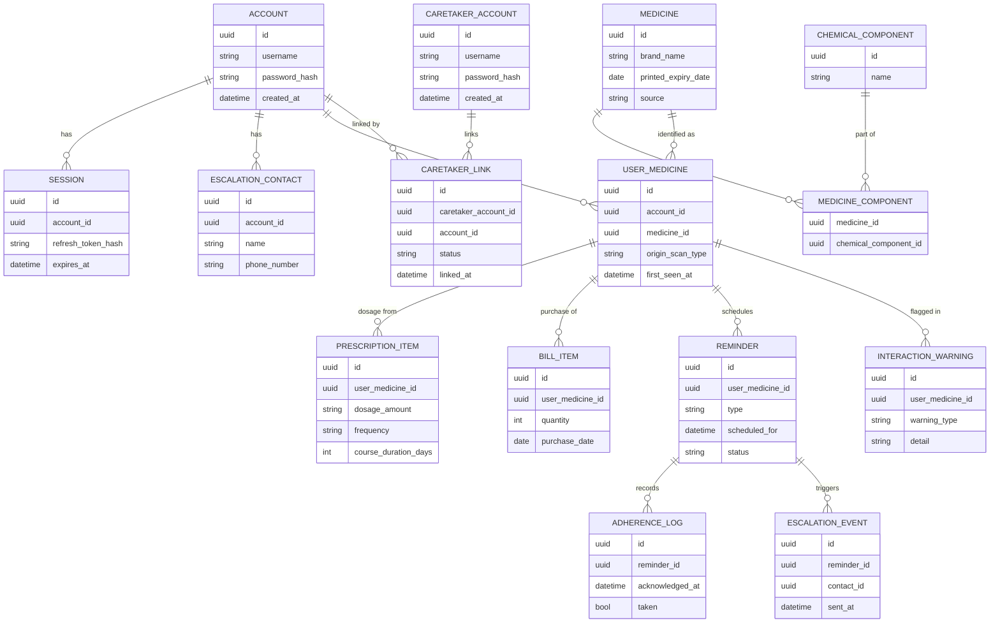

# ARCH-03 — Data Model

Status: Approved

## Overview

PostgreSQL holds two kinds of data:

- **Reference data** — shared, mostly-static: medicines, their chemical components, standard/elderly dosages, known interactions. Sourced from a local dataset with an online fallback that gets cached back in ([REQ-02](../Requirements/REQ-02-medicine-identification.md), [REQ-04](../Requirements/REQ-04-dosage-suggestion.md)).
- **Per-user data** — everything the app learns about a specific patient across independent scans ([REQ-00](../Requirements/REQ-00-behavior-model.md)): their medicines, prescriptions, bills, reminders, adherence, and escalation contacts.

`ACCOUNT` below is the **elderly user's** account (created at REQ-15 onboarding, Phase 1). `CARETAKER_ACCOUNT` is a separate identity (Phase 2, [REQ-16](../Requirements/REQ-16-caretaker-multi-patient-linking.md)) linked to one or more `ACCOUNT` rows via `CARETAKER_LINK` — this is what lets one caretaker manage several elderly users from a single login.

## Entity overview

## Notes

- `MEDICINE` ↔ `CHEMICAL_COMPONENT` is many-to-many via `MEDICINE_COMPONENT`, so combination drugs and brand-equivalence matching (REQ-02's "complete overlap mandatory" rule) can be computed by comparing component sets.
- `USER_MEDICINE` is the per-user anchor: it's what links a prescription entry, a bill entry, and reminders together as "the same medicine for this person," regardless of which scan type it originated from — this is the concrete implementation of REQ-00's persistence/fallback model.
- `REMINDER.type` distinguishes intake reminders (REQ-06) from refill reminders (REQ-08), since they have different lifecycles (course-duration-bound vs. run-out-date-bound).
- `CARETAKER_LINK` is modeled as its own join entity (rather than a plain many-to-many) specifically so a link can carry a `status` (e.g. `pending`/`active`) — a link requested during REQ-15 onboarding, before the caretaker has actually created their Phase 2 account, needs somewhere to sit until it resolves.
- Many-to-many is intentional both ways: one caretaker can link to multiple `ACCOUNT` rows, and one `ACCOUNT` can have multiple `CARETAKER_LINK` rows (multiple caretakers, e.g. siblings sharing duties) — both directions are decided requirements (REQ-16), not just schema headroom.
- `CARETAKER_LINK.status` today only ever reaches `active` by a valid identifier being supplied — there is no approval-gated status yet. This is a known, deliberate gap (see REQ-16/ARCH-02) to be closed in Phase 2.

## Open questions

- Exact schema for storing multi-language label text/translations (REQ-03) is not detailed here yet — likely a `MEDICINE_LABEL_TRANSLATION` table, to be fleshed out in Design.
- Retention/history policy for `ADHERENCE_LOG` and `ESCALATION_EVENT` (how long is history kept, does it feed into REQ-10's dashboard views) is undefined.
