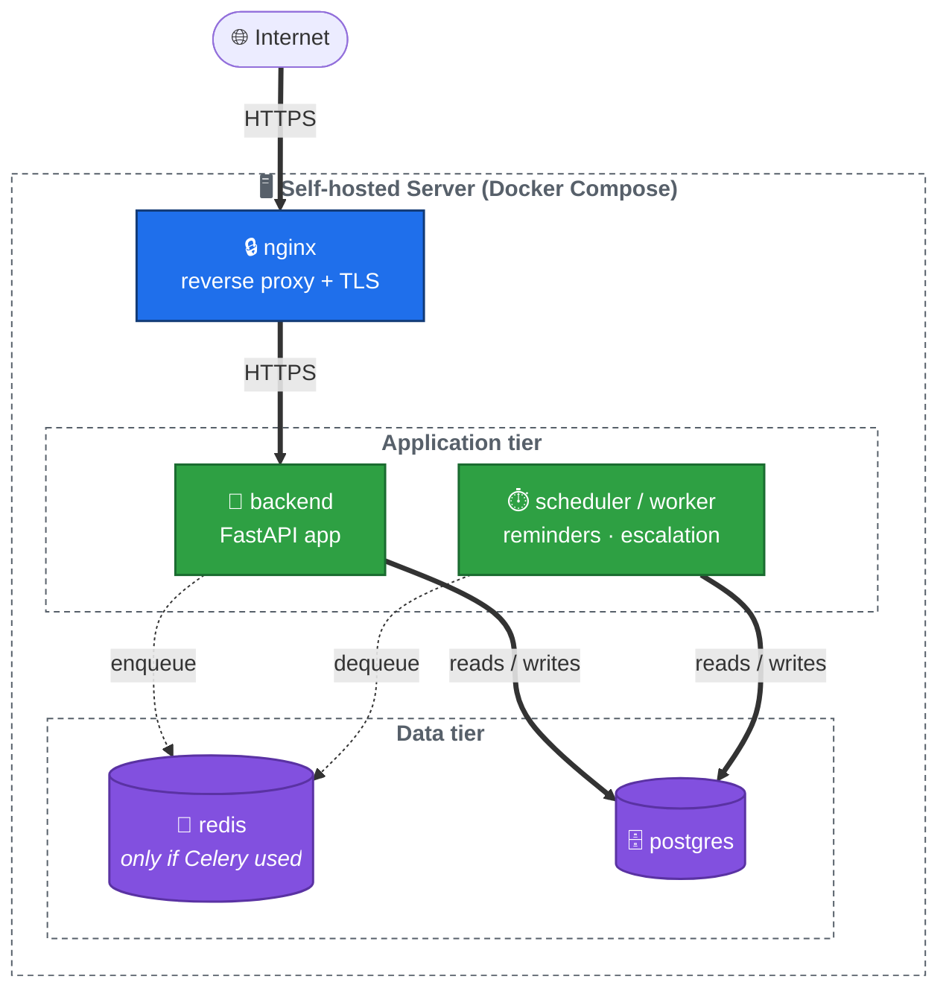

# ARCH-04 — Deployment

Status: Approved

## Approach

Self-hosted, containerized — chosen so the specific hosting location (home server, VPS, etc.) can change without an architecture change. Docker Compose ties the pieces together for a single-host deployment; nothing here assumes a specific cloud provider.

## Layout

🔵 Edge/proxy · 🟢 Application tier · 🟣 Data tier

## Components

- **nginx** — TLS termination and reverse proxy in front of the backend; the only container exposed to the internet.
- **backend** — the FastAPI app (API + service layer + integration adapters).
- **scheduler/worker** — runs reminder/escalation checks on a cadence, independent of API request traffic.
- **redis** — only needed if Celery is chosen as the scheduler/task-queue implementation; APScheduler wouldn't require it.
- **postgres** — the data layer (ARCH-03).

## Open questions

- Backup/restore strategy for PostgreSQL (this holds all patient medical data — needs a real plan, not an afterthought).
- Monitoring/alerting for the self-hosted server itself (uptime, disk space, certificate renewal).
- Final choice between APScheduler (simpler, in-process) and Celery+Redis (more robust, more moving parts) for the scheduler.
