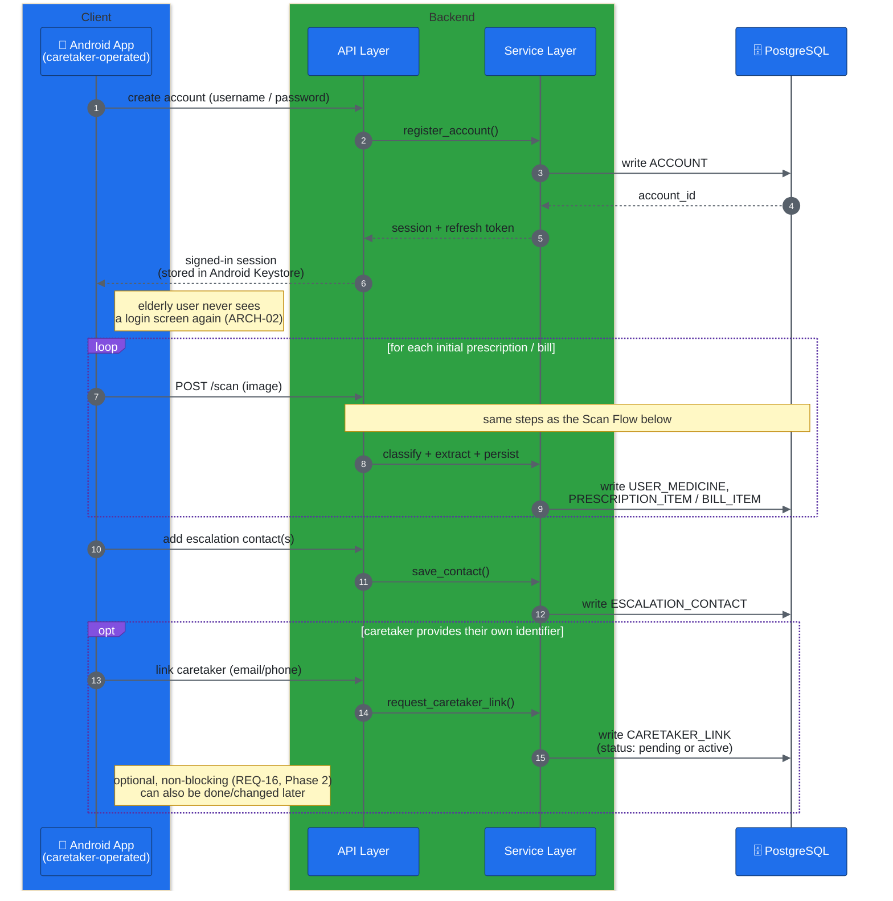
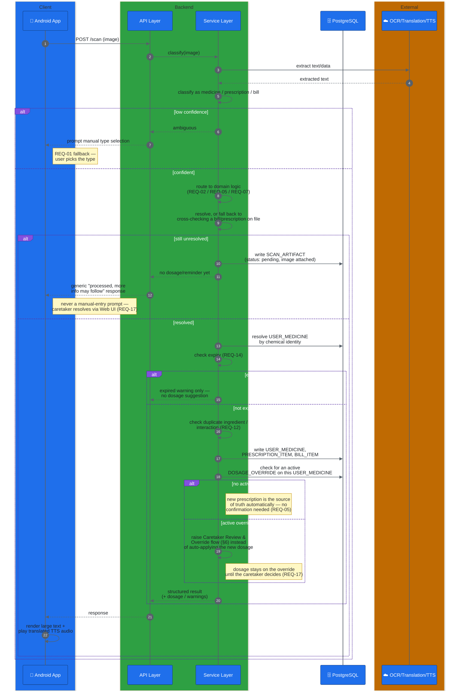
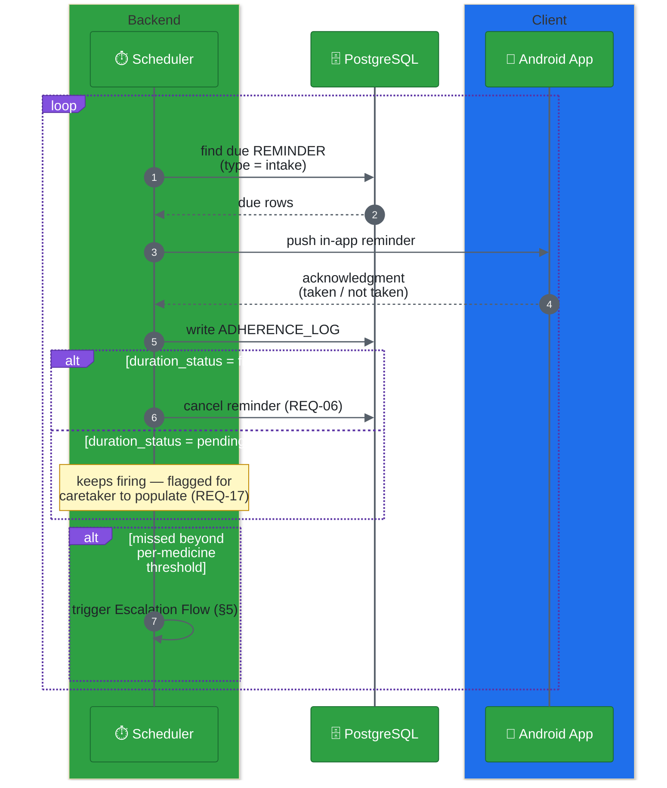
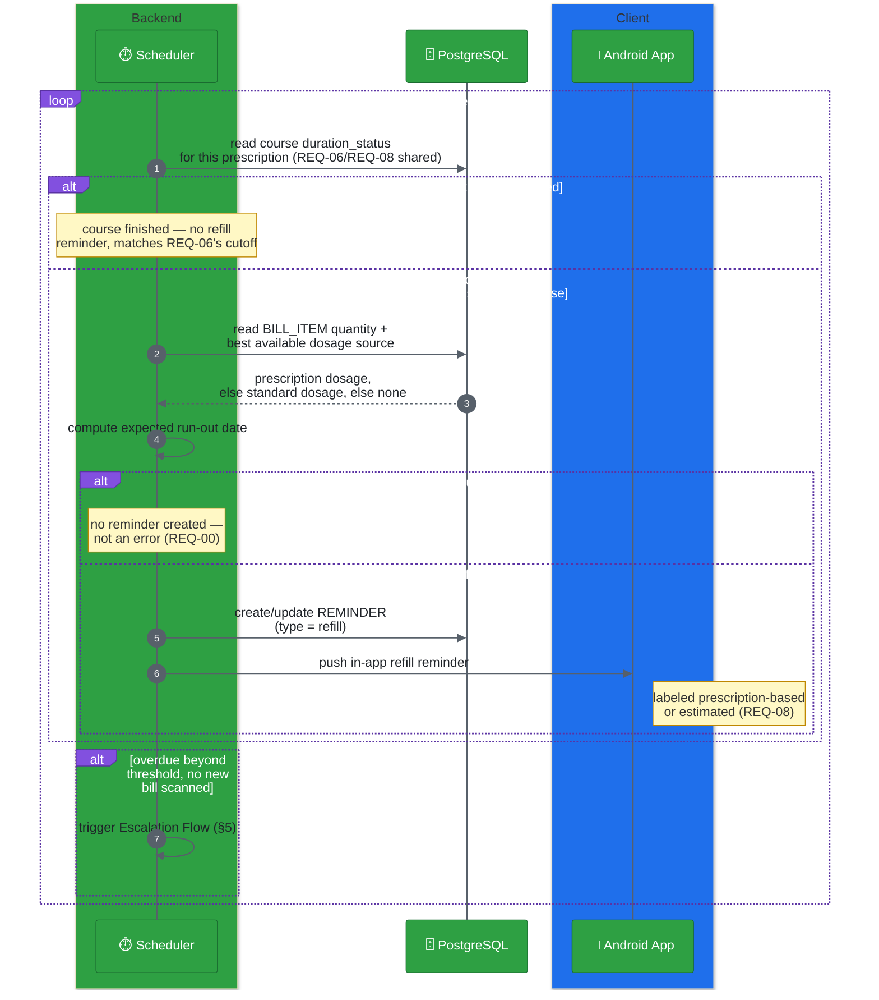
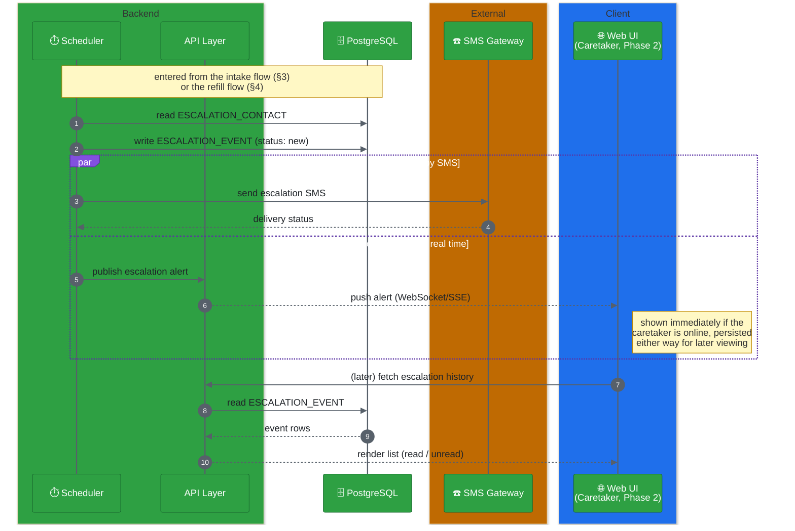

# ARCH-05 — Key Flows

Status: Approved

Six flows cover the system end to end: how an account gets set up, how a scan is processed, how the two reminder types work, how a missed dose/refill escalates to a caretaker, and how a caretaker resolves what the system couldn't and supervises what it did.

## 1. Onboarding & account setup flow

Covers [REQ-15](../Requirements/REQ-15-assisted-onboarding.md) — the caretaker performs this on the elderly user's device.



## 2. Scan flow

Covers [REQ-01](../Requirements/REQ-01-input-classification.md) through the relevant downstream requirement depending on classification, plus the automatic safety checks that run alongside it.



## 3. Intake reminder flow

Covers [REQ-06](../Requirements/REQ-06-dosage-reminder.md) — only exists once a prescription has been scanned.



## 4. Refill reminder flow

Covers [REQ-08](../Requirements/REQ-08-refill-reminder.md) — seeded by a bill's purchased quantity, using whichever dosage source is available per [REQ-00](../Requirements/REQ-00-behavior-model.md)'s fallback order.



## 5. Escalation flow

Covers [REQ-13](../Requirements/REQ-13-missed-dose-escalation.md) — triggered by either the intake flow (§3) or the refill flow (§4). Notifies the saved contact by SMS **and** alerts the caretaker in the Web UI (Phase 2), not one or the other.



## 6. Caretaker review & override flow

Covers [REQ-17](../Requirements/REQ-17-caretaker-review-and-override.md) — Phase 2. Resolves scans the Scan Flow (§2) couldn't process, lets the caretaker correct dosage/reminders directly, and handles a new prescription conflicting with an existing override. This is the **only** place structured medicine data is ever manually entered — never on the Android app, per REQ-17. Every action here requires a reason and is permanently attributed to the acting caretaker account and timestamped — none of it is a bare data edit.

```mermaid
%%{init: {"theme": "base", "themeVariables": {"actorBkg": "#1f6feb", "actorBorder": "#123a75", "actorTextColor": "#ffffff", "actorLineColor": "#57606a", "signalColor": "#57606a", "signalTextColor": "#1f2328", "labelBoxBkgColor": "#8250df", "labelBoxBorderColor": "#5a32a3", "labelTextColor": "#ffffff", "noteBkgColor": "#fff8c5", "noteBorderColor": "#bf8700"}} }%%
sequenceDiagram
    autonumber
    box rgb(31,111,235) Client
        participant WebUI as 🌐 Web UI<br/>(Caretaker, Phase 2)
    end
    box rgb(46,160,67) Backend
        participant API as API Layer
        participant SVC as Service Layer
    end
    participant DB as 🗄️ PostgreSQL

    rect rgb(40,44,52)
    Note over WebUI,DB: Resolving a pending scan (§2)
    WebUI->>API: fetch review queue
    API->>DB: read SCAN_ARTIFACT<br/>(status = pending)
    DB-->>API: pending rows + images
    API-->>WebUI: render queue
    WebUI->>API: submit corrected data<br/>+ required reason
    API->>SVC: resolve_scan_artifact()
    SVC->>DB: write USER_MEDICINE,<br/>PRESCRIPTION_ITEM / BILL_ITEM
    SVC->>DB: update SCAN_ARTIFACT<br/>(status: resolved, resolved_by,<br/>resolution_reason, resolved_at)
    SVC-->>API: same downstream logic as a<br/>successful scan (REQ-04/06/08)
    end

    rect rgb(40,44,52)
    Note over WebUI,DB: Overriding a dosage/reminder directly
    WebUI->>API: fetch current dosage<br/>for a linked elderly user's medicine
    API->>DB: read USER_MEDICINE +<br/>current dosage source
    DB-->>API: current dosage + source
    API-->>WebUI: render for review
    WebUI->>API: submit corrected dosage<br/>+ required reason
    API->>SVC: set_dosage_override()
    SVC->>DB: write DOSAGE_OVERRIDE<br/>(reason, set_by, status: active)
    Note right of DB: outranks prescription/standard/<br/>online sources from now on (REQ-04/08)
    end

    rect rgb(40,44,52)
    Note over WebUI,DB: New prescription conflicts with an active override —<br/>the ONLY case that ever pauses for confirmation;<br/>every other prescription update applies automatically (REQ-05)
    Note over SVC,DB: entered from the Scan Flow (§2) when a<br/>scanned PRESCRIPTION_ITEM targets a<br/>USER_MEDICINE with an active DOSAGE_OVERRIDE
    SVC->>DB: write PRESCRIPTION_CONFLICT_REVIEW<br/>(decision: pending)
    SVC->>API: publish review-needed alert
    API-->>WebUI: show conflict:<br/>current override vs. new prescription
    WebUI->>API: decision (approve / decline)<br/>+ required reason
    API->>SVC: resolve_conflict()
    alt approved
        SVC->>DB: update DOSAGE_OVERRIDE<br/>(status: superseded)
        Note right of DB: dosage now flows from the<br/>new prescription (REQ-04 normal order)
    else declined
        SVC->>DB: leave DOSAGE_OVERRIDE unchanged<br/>(status: active)
    end
    SVC->>DB: update PRESCRIPTION_CONFLICT_REVIEW<br/>(decision, reason, decided_by, decided_at)
    end
```

## Notes

- The scheduler drives both reminder types proactively (push), rather than the app polling for them — needed since REQ-06/REQ-08/REQ-13 must function even if no client is actively open.
- Intake (§3) and refill (§4) reminders are kept as separate flows since they're triggered differently (schedule vs. run-out date), but they now share the same course-completion source (`PRESCRIPTION_ITEM.duration_status`, ARCH-03) rather than tracking two independent end conditions — see [ARCH-06](ARCH-06-scan-combination-behavior.md).
- Escalation (§5) is shared logic — both reminder types feed into the same flow rather than each implementing their own notification path, so SMS + Web UI delivery only needs to be built once.
- The Web UI alert path (§5) is Phase 2 — until REQ-10 ships, escalation is SMS-only, but `ESCALATION_EVENT` is written from day one so history is complete once the Web UI arrives.
- The review/override flow (§6) is also Phase 2. In Phase 1, a scan that reaches the "still unresolved" branch of §2 just stays pending indefinitely — there is no resolution path until the Web UI ships. `SCAN_ARTIFACT` is written from day one, same reasoning as `ESCALATION_EVENT` above, so nothing is lost while waiting.
