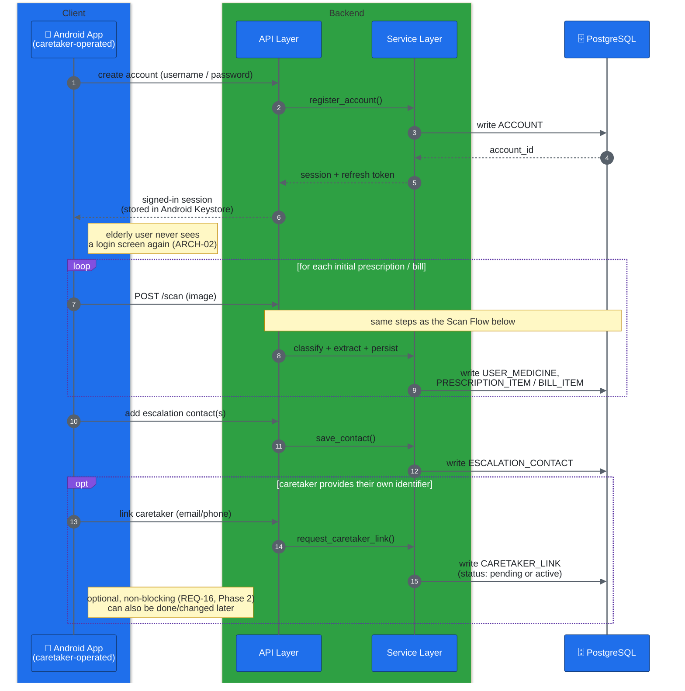
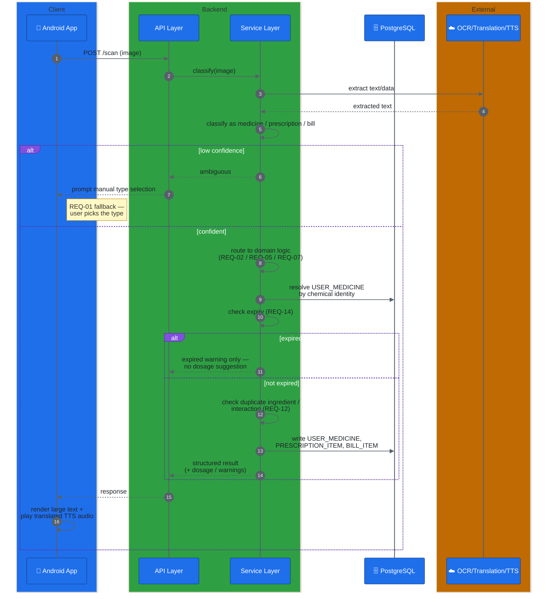
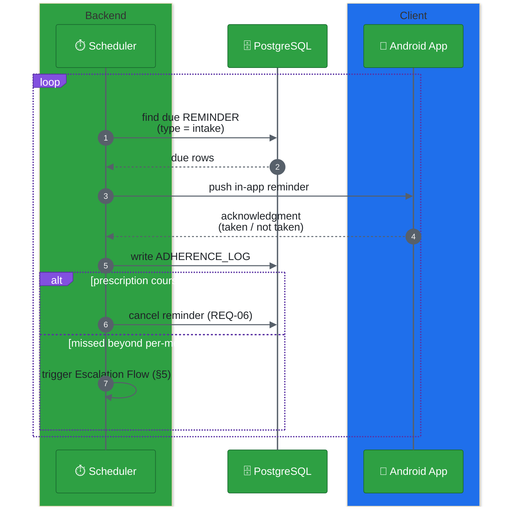
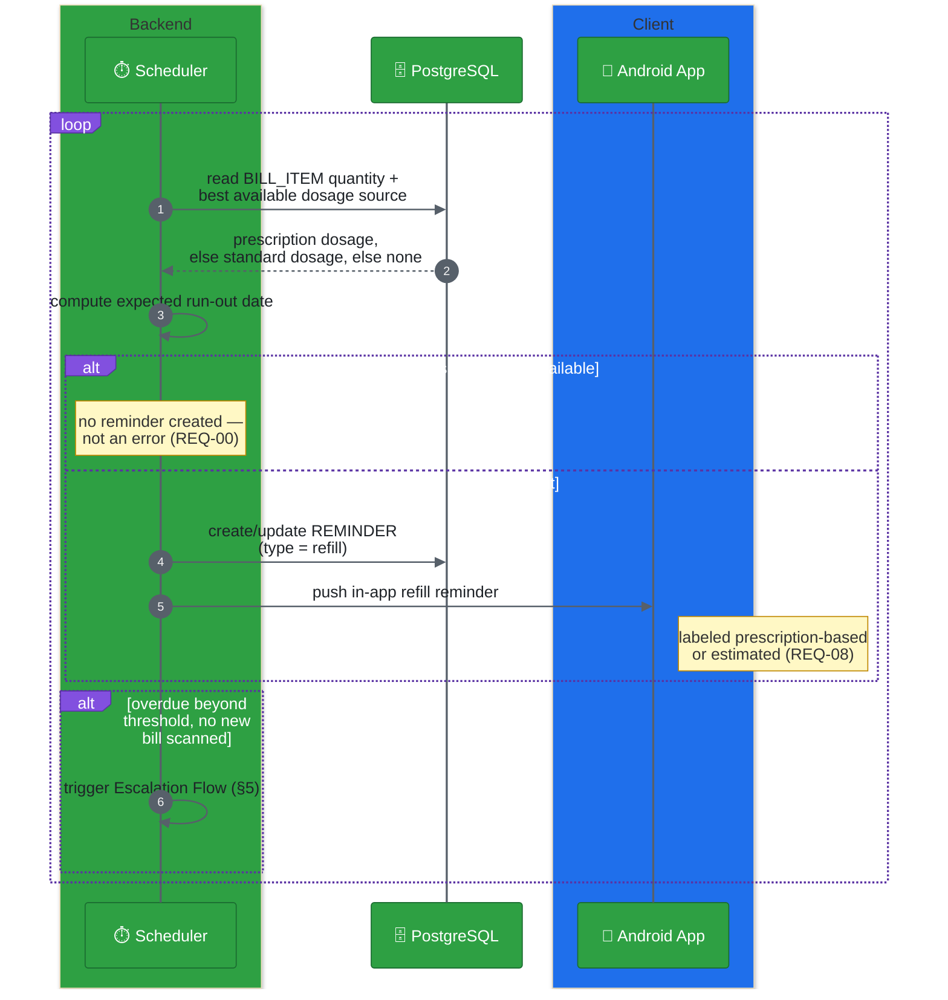
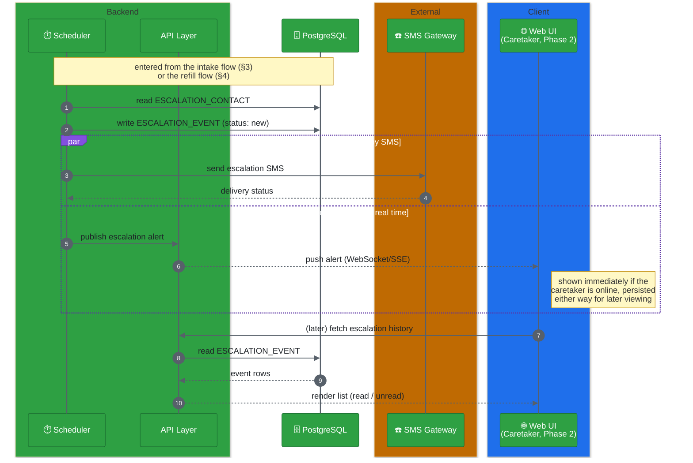

# ARCH-05 — Key Flows

Status: Approved

Five flows cover the system end to end: how an account gets set up, how a scan is processed, how the two reminder types work, and how a missed dose/refill escalates to a caretaker.

## 1. Onboarding & account setup flow

Covers [REQ-15](../Requirements/REQ-15-assisted-onboarding.md) — the caretaker performs this on the elderly user's device.

## 2. Scan flow

Covers [REQ-01](../Requirements/REQ-01-input-classification.md) through the relevant downstream requirement depending on classification, plus the automatic safety checks that run alongside it.

## 3. Intake reminder flow

Covers [REQ-06](../Requirements/REQ-06-dosage-reminder.md) — only exists once a prescription has been scanned.

## 4. Refill reminder flow

Covers [REQ-08](../Requirements/REQ-08-refill-reminder.md) — seeded by a bill's purchased quantity, using whichever dosage source is available per [REQ-00](../Requirements/REQ-00-behavior-model.md)'s fallback order.

## 5. Escalation flow

Covers [REQ-13](../Requirements/REQ-13-missed-dose-escalation.md) — triggered by either the intake flow (§3) or the refill flow (§4). Notifies the saved contact by SMS **and** alerts the caretaker in the Web UI (Phase 2), not one or the other.

## Notes

- The scheduler drives both reminder types proactively (push), rather than the app polling for them — needed since REQ-06/REQ-08/REQ-13 must function even if no client is actively open.
- Intake (§3) and refill (§4) reminders are kept as separate flows because their lifecycles differ: intake ends at course completion, refill has no course-completion concept yet (open question, see [ARCH-06](ARCH-06-scan-combination-behavior.md)).
- Escalation (§5) is shared logic — both reminder types feed into the same flow rather than each implementing their own notification path, so SMS + Web UI delivery only needs to be built once.
- The Web UI alert path (§5) is Phase 2 — until REQ-10 ships, escalation is SMS-only, but `ESCALATION_EVENT` is written from day one so history is complete once the Web UI arrives.
