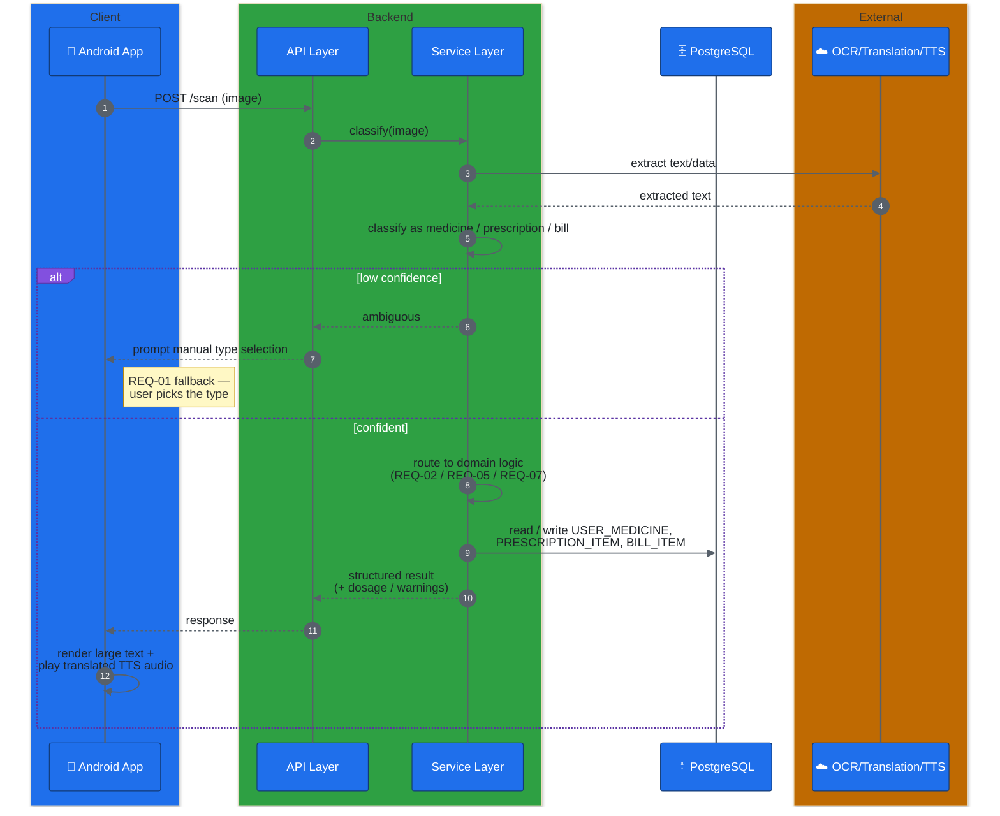
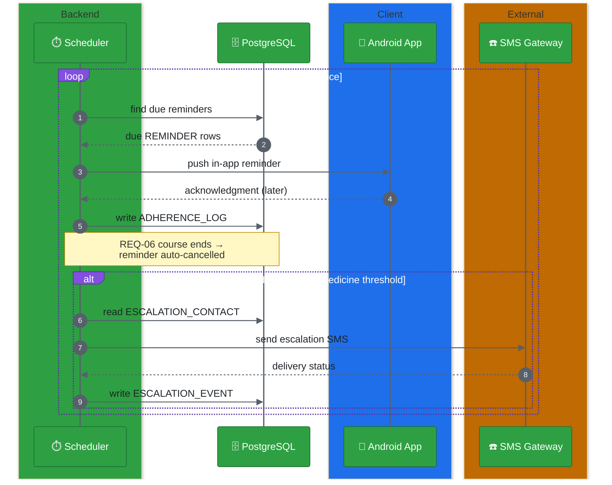

# ARCH-05 — Key Flows

Status: Draft — pending review

## Scan flow

Covers [REQ-01](../Requirements/REQ-01-input-classification.md) through the relevant downstream requirement depending on classification.

## Reminder & escalation flow

Covers [REQ-06](../Requirements/REQ-06-dosage-reminder.md), [REQ-08](../Requirements/REQ-08-refill-reminder.md), and [REQ-13](../Requirements/REQ-13-missed-dose-escalation.md).

## Notes

- The scheduler drives reminders proactively (push), rather than the app polling for them — needed since REQ-06/REQ-13 must function even if the app isn't actively open.
- Refill reminders (REQ-08) follow the same shape as the reminder loop above, but are seeded by `BILL_ITEM` quantity + whichever dosage source is available (REQ-00's fallback order), rather than a prescription's frequency field directly.
