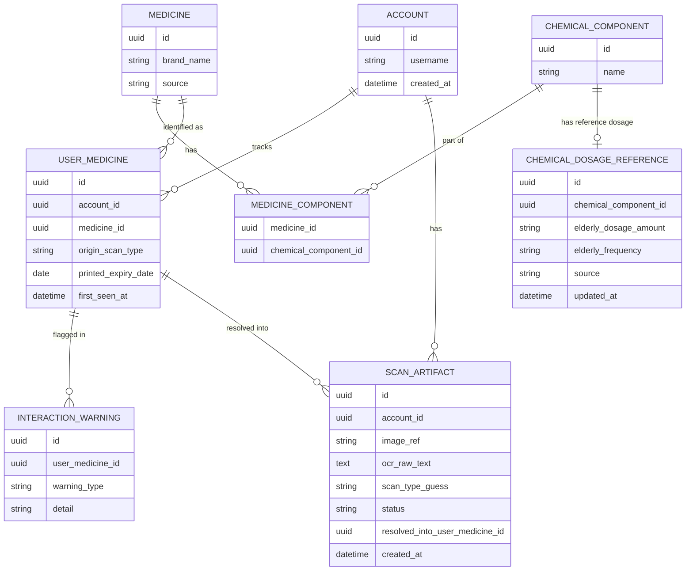

# Database Schema — Medicine Scan Slice

Status: Draft — pending review

## Scope

[Arch/ARCH-03](../../Arch/ARCH-03-data-model.md) defines the *full* entity model for the whole system. This document turns just the slice of it needed for the medicine-scan vertical slice into a concrete, typed schema — prescriptions, bills, reminders, escalation, and caretaker/override tables are **not** created yet; they'll get their own schema pass when those slices are implemented.

Two corrections beyond ARCH-03, found while designing at unit level:

1. A `CHEMICAL_DOSAGE_REFERENCE` table. ARCH-03 never actually modeled *where* the "standard elderly dosage" data (REQ-04) lives — this was a known open question in REQ-04 ("which reference source populates the local database's elderly dosage data" — still not chosen, but the table shape needs to exist regardless of which source eventually fills it).
2. **`printed_expiry_date` moved from `medicine` to `user_medicine`.** ARCH-03 originally placed it on `medicine`, which is shared reference data across every user who's ever scanned that brand. Expiry date belongs to the *physical pack a specific user scanned*, not the brand — leaving it on `medicine` would mean one user's expired pack incorrectly flags the same medicine as expired for every other user. `user_medicine` also gains `printed_expiry_date`, updated on every scan (a rescan may reflect a newer pack).

## Entities

## Table definitions

### `account`
Minimal for this slice — no password/session columns yet, since REQ-15 onboarding/auth isn't implemented here. Just enough to exist as a foreign-key target.

| Column | Type | Constraints |
|---|---|---|
| `id` | `uuid` | PK, default `gen_random_uuid()` |
| `username` | `varchar(100)` | NOT NULL, UNIQUE |
| `created_at` | `timestamptz` | NOT NULL, default `now()` |

### `medicine`
Reference data — one row per distinct brand-name product.

| Column | Type | Constraints |
|---|---|---|
| `id` | `uuid` | PK |
| `brand_name` | `varchar(200)` | NOT NULL |
| `source` | `varchar(20)` | NOT NULL — `'local'` or `'online'`, per REQ-02's lookup order |

### `chemical_component`
Reference data — one row per distinct active ingredient.

| Column | Type | Constraints |
|---|---|---|
| `id` | `uuid` | PK |
| `name` | `varchar(200)` | NOT NULL, UNIQUE |

### `medicine_component`
Join table — a medicine's full set of active ingredients. REQ-02's "complete overlap mandatory" equivalence rule is implemented by comparing the full set of `chemical_component_id`s for two `medicine` rows, not by any column here.

| Column | Type | Constraints |
|---|---|---|
| `medicine_id` | `uuid` | PK (composite), FK → `medicine.id` |
| `chemical_component_id` | `uuid` | PK (composite), FK → `chemical_component.id` |

### `chemical_dosage_reference`
New table (not in ARCH-03) — standard elderly dosage per **single** chemical component. See Open Questions below for the combination-drug limitation this implies.

**This table is intentionally shared/global, not per-account** — it's REQ-04's Tier 3 generic fallback, not a place to store any individual patient's actual prescribed dose. For example: if User A is prescribed `1-0-1` and User B is prescribed `2-0-2` for the same medicine, neither value belongs here — each lives in that user's own `prescription_item` row (per-account, via `user_medicine`; not yet part of this slice's schema), which outranks this table per REQ-04's fallback order. Until prescription-scanning (REQ-05) is implemented, every account sees the same value from this table for a given medicine, clearly labeled as a non-personalized suggestion (see the [Dosage unit](units/Dosage/README.md)) — that's expected for now, not a design flaw.

| Column | Type | Constraints |
|---|---|---|
| `id` | `uuid` | PK |
| `chemical_component_id` | `uuid` | NOT NULL, UNIQUE, FK → `chemical_component.id` |
| `elderly_dosage_amount` | `varchar(100)` | NOT NULL |
| `elderly_frequency` | `varchar(100)` | NOT NULL |
| `source` | `varchar(200)` | NOT NULL — which guideline/reference this came from |
| `updated_at` | `timestamptz` | NOT NULL, default `now()` |

### `user_medicine`
The per-account anchor (REQ-00) — one row per (account, medicine-by-chemical-identity) pair.

| Column | Type | Constraints |
|---|---|---|
| `id` | `uuid` | PK |
| `account_id` | `uuid` | NOT NULL, FK → `account.id` |
| `medicine_id` | `uuid` | NOT NULL, FK → `medicine.id` |
| `origin_scan_type` | `varchar(20)` | NOT NULL — `'medicine'` for this slice (`'prescription'`/`'bill'` reserved) |
| `printed_expiry_date` | `date` | nullable — from the most recent scan of this medicine; not every scan yields a readable date |
| `first_seen_at` | `timestamptz` | NOT NULL, default `now()` |

**Uniqueness note**: there is no DB-level uniqueness constraint tying `(account_id, medicine_id)` together, because chemical-identity equivalence (REQ-02) is a set-comparison across *different* `medicine_id`s (e.g. Calpol and Dolo), not something a simple unique index can express. Uniqueness is enforced in application code — see the [UserMedicine unit](units/UserMedicine/README.md).

### `scan_artifact`
**Written for every scan, not just unresolved ones** — the audit log of everything a user has ever scanned, image included. This is a deliberate decision: the image always reaches the backend regardless of outcome, so a caretaker can review any scan later, not only the ones that failed. For a `'pending'` row (couldn't be classified/resolved, REQ-01/REQ-05/REQ-07), only the *write* path is implemented in this slice — there's no caretaker Web UI yet to resolve these, so those rows sit at `status = 'pending'` indefinitely, which is expected per REQ-00's silent-skip principle, not a bug.

| Column | Type | Constraints |
|---|---|---|
| `id` | `uuid` | PK |
| `account_id` | `uuid` | NOT NULL, FK → `account.id` |
| `image_ref` | `text` | NOT NULL — storage path/URL for the original image, always present |
| `ocr_raw_text` | `text` | nullable — whatever Android's on-device OCR extracted, stored so a future caretaker reviewer has context, not just the image |
| `scan_type_guess` | `varchar(20)` | nullable — `'medicine'` if Android or the backend identified it as such, null if classification itself was ambiguous |
| `status` | `varchar(20)` | NOT NULL — `'resolved'` or `'pending'` |
| `resolved_into_user_medicine_id` | `uuid` | nullable, FK → `user_medicine.id` — populated when `status = 'resolved'`; stays null for a `'pending'` row until Phase 2's caretaker Web UI resolves it |
| `created_at` | `timestamptz` | NOT NULL, default `now()` |

### `interaction_warning`
Written by the duplicate-ingredient check (REQ-12). In this slice, only the duplicate-ingredient case is implemented — a real drug-drug interaction database is not (see the [Interaction unit](units/Interaction/README.md)).

| Column | Type | Constraints |
|---|---|---|
| `id` | `uuid` | PK |
| `user_medicine_id` | `uuid` | NOT NULL, FK → `user_medicine.id` |
| `warning_type` | `varchar(30)` | NOT NULL — `'duplicate_ingredient'` for this slice |
| `detail` | `text` | NOT NULL — human-readable explanation |

## Open questions

- `chemical_dosage_reference` is keyed on a **single** chemical component. A combination drug (multiple active ingredients) has no defined dosage lookup yet — the [Dosage unit](units/Dosage/README.md) treats this as "dosage not available" rather than guessing. Needs a real design decision once a combination-drug medicine is actually tested against.
- Source of truth for populating `chemical_dosage_reference` is still unresolved (same open question as REQ-04) — this schema just gives it somewhere to live once that's decided.
