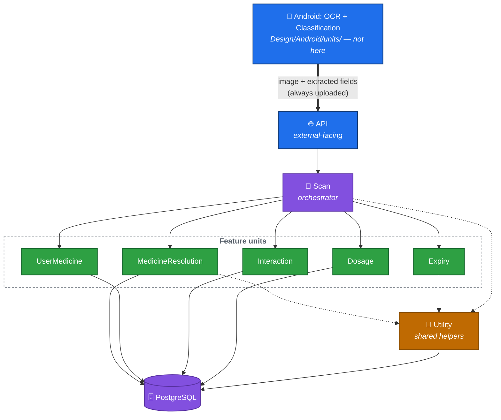

# Backend Unit Breakdown

Status: Draft — pending review

## What a "unit" is, in this project

A **unit** is one self-contained piece of backend responsibility, with:
- A single public interface other units are allowed to call.
- Its own folder here, containing its full design (responsibility, interface, algorithm, data touched, test cases).
- No direct dependency on the web framework or HTTP concerns, **except** the API unit.

This gives every unit a place code and tests can be generated from directly, and a clear boundary for what depends on what.

## The three kinds of unit

1. **The API unit** — exactly one, the *only* unit allowed to touch HTTP directly (FastAPI routes, request/response translation). Nothing outside it knows this is a web service.
2. **Feature units** — one per distinct piece of behavior (`Scan`, `MedicineResolution`, `UserMedicine`, `Expiry`, `Interaction`, `Dosage`). Each owns one job and the data access it needs to do that job.
3. **The Utility unit** — exactly one, holding small helpers with no feature-specific knowledge, that any other unit can call (text normalization, "what is today," image storage).

**Not every unit for this slice lives here.** OCR and Classification are designed in [Design/Android/units/](../../Android/units/README.md) instead — they're consumed by exactly one frontend and never touch shared state, so per [Arch/ARCH-00](../../../Arch/ARCH-00-overview.md#why-not-put-logic-on-device-and-the-one-exception)'s test, they belong on-device, not here. `Scan`'s input already assumes OCR/classification happened — see its design.

## Units in this slice

| Unit | Kind | Responsibility |
|---|---|---|
| [API](../units/API/README.md) | External-facing | Only unit exposed over HTTP. Validates requests, calls `Scan`, translates results to JSON responses. |
| [Scan](../units/Scan/README.md) | Feature (orchestrator) | The `/scan` use case end to end, starting from what Android already extracted — calls every other feature unit in the right order and assembles the final result. |
| [MedicineResolution](../units/MedicineResolution/README.md) | Feature | Resolves a brand name to a `medicine` reference-data record. |
| [UserMedicine](../units/UserMedicine/README.md) | Feature | Resolves/creates the per-account `user_medicine` record, applying chemical-identity equivalence. |
| [Expiry](../units/Expiry/README.md) | Feature | Decides expired / expiring-soon / fine. |
| [Interaction](../units/Interaction/README.md) | Feature | Detects shared active ingredients across an account's medicines. |
| [Dosage](../units/Dosage/README.md) | Feature | Resolves a dosage suggestion via REQ-04's fallback order. |
| [Utility](../units/Utility/README.md) | Shared | Text normalization, current-date access, image storage — used by multiple feature units above. |

## Dependency graph

Solid arrows are "calls directly." Dotted arrows are "uses shared helpers from." The thick arrow from `Android` is the one place this diagram crosses outside the backend, to make clear that `API` never performs OCR/classification itself — it just receives the already-decided result. Nothing calls `API` from within the backend; it's the only entry point.

## Rules every unit follows

- A feature unit never imports another feature unit directly — if it needs another feature's result, that composition happens in `Scan` (the orchestrator), not peer-to-peer. This keeps each feature unit testable in isolation.
- `API` depends on exactly one unit — `Scan` — and nothing else (no direct DB access, no direct calls into `MedicineResolution`/`Dosage`/etc.). `Scan` is the only unit allowed to import more than one other feature unit, since composing them is its whole job. Every other feature unit may depend on `Utility` and the database, and nothing else.
- Every unit's design doc must include enough test cases (with concrete inputs and expected outputs) that its tests could be written without asking anyone a follow-up question.

## Cross-references

- [`../db-schema.md`](../db-schema.md) — the tables these units read/write.
- [`../tech-stack.md`](../tech-stack.md) — the concrete tooling (FastAPI, SQLAlchemy, etc.) these units are implemented with.
- [`../../Interop/scan-endpoint.md`](../../Interop/scan-endpoint.md) — the wire contract the `API` unit implements.
