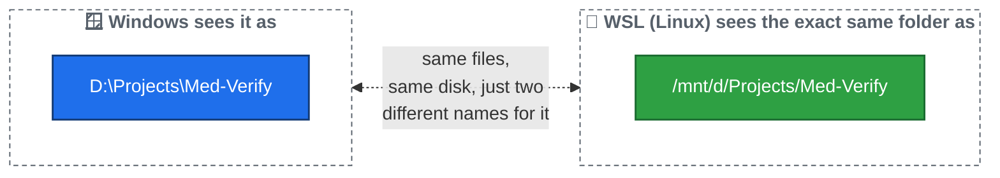

# 00 — Windows Terminal, WSL, and Basic Linux Commands

Before we touch Git at all, you need to be comfortable with the environment you're typing commands into. This file explains that setup and teaches you the handful of Linux commands you'll use constantly.

## What is WSL, and why are we using it?

Your computer runs **Windows**. But most programming tools (including the way this project's Git workflow is set up) are built assuming a **Linux** environment.

**WSL** stands for **Windows Subsystem for Linux**. It's a real Linux environment that runs *inside* your Windows computer. You get the best of both: your normal Windows desktop, apps, and files — plus a genuine Linux command line whenever you need one.

**Windows Terminal** is just the app window you type commands into. Inside it, you can open different kinds of tabs — a plain Windows one (PowerShell/Command Prompt), or a **WSL tab** (Linux). **You should always be working in a WSL tab for this project**, not a plain Windows one.

To open one: open **Windows Terminal**, click the little **∨** arrow next to the `+` tab button, and choose your Linux distribution (commonly named **Ubuntu**). If you're not sure which one, ask whoever set up your computer.

## How to tell if you're in the right place

A WSL terminal prompt usually looks like this:

```
yourname@COMPUTERNAME:~$
```

A plain Windows PowerShell prompt looks quite different, usually starting with something like `PS C:\Users\...>`. If you ever see a `PS ...>` prompt, you're in the wrong kind of tab — close it and open a WSL one instead.

## The most important idea: two different ways to see the same files

Your computer's hard drives (like `D:` in Windows) are visible from *inside* WSL too — just written differently. This trips up almost everyone at first, so read this twice:

| In Windows, you'd write... | In WSL (Linux), the same folder is... |
|---|---|
| `D:\Projects\Med-Verify` | `/mnt/d/Projects/Med-Verify` |
| `C:\Users\YourName\Documents` | `/mnt/c/Users/YourName/Documents` |

The pattern: `D:\` becomes `/mnt/d/`, `C:\` becomes `/mnt/c/`, and every `\` becomes a `/`.

**For this project specifically**, if your project folder lives in `D:\Projects\Med-Verify` on Windows, you will `cd` into `/mnt/d/Projects/Med-Verify` inside your WSL terminal to work on it. Every command in the rest of this guide assumes you're sitting inside that folder, in a WSL terminal.



## The Linux commands you need to know

You'll use these constantly. Try each one right now in your WSL terminal.

| Command | What it means | What it does |
|---|---|---|
| `pwd` | **P**rint **W**orking **D**irectory | Shows you the full path of the folder you're currently "standing in." |
| `ls` | **L**i**s**t | Shows you the files and folders inside your current folder. |
| `ls -la` | List, "long" + "all" | Same as `ls`, but shows more detail and even hidden files (ones starting with a `.`, like `.git`). |
| `cd <folder>` | **C**hange **D**irectory | Moves you *into* a folder. |
| `cd ..` | Change Directory, up one | Moves you *up* one folder (to the parent). |
| `cd ~` | Change Directory, home | Jumps straight back to your home folder, from anywhere. |
| `clear` | — | Clears all the clutter off your terminal screen. Doesn't undo anything, just tidies up what you can see. |

### A worked example

```bash
pwd
# /home/yourname

cd /mnt/d/Projects
ls
# Med-Verify   (and maybe other folders)

cd Med-Verify
pwd
# /mnt/d/Projects/Med-Verify

ls -la
# shows every file and folder in the project, including the hidden .git folder
```

Notice: once you're already inside `/mnt/d/Projects`, you can just type `cd Med-Verify` — you don't have to retype the whole path every time, only the part that gets you from *where you are* to *where you want to go*.

## Opening the project in VS Code, from WSL

Once you're `cd`'d into the project folder inside your WSL terminal, open it in VS Code with:

```bash
code .
```

This does something important: it opens VS Code in **WSL mode**, connected to your Linux files at `/mnt/d/Projects/Med-Verify` — not a separate Windows copy. You'll know it worked because the **bottom-left corner of VS Code** shows a little green badge that says **"WSL: Ubuntu"** (or similar). If that badge is missing, VS Code may have opened the Windows-side view instead — close it and run `code .` again from your WSL terminal.

**Every terminal you use from here on — including VS Code's own built-in terminal, once it's opened this way — will already be a WSL terminal in the right folder.** That's the setup you want for the rest of this guide.

**Next:** [01 — What is Git and GitHub?](01-what-is-git-and-github.md)
