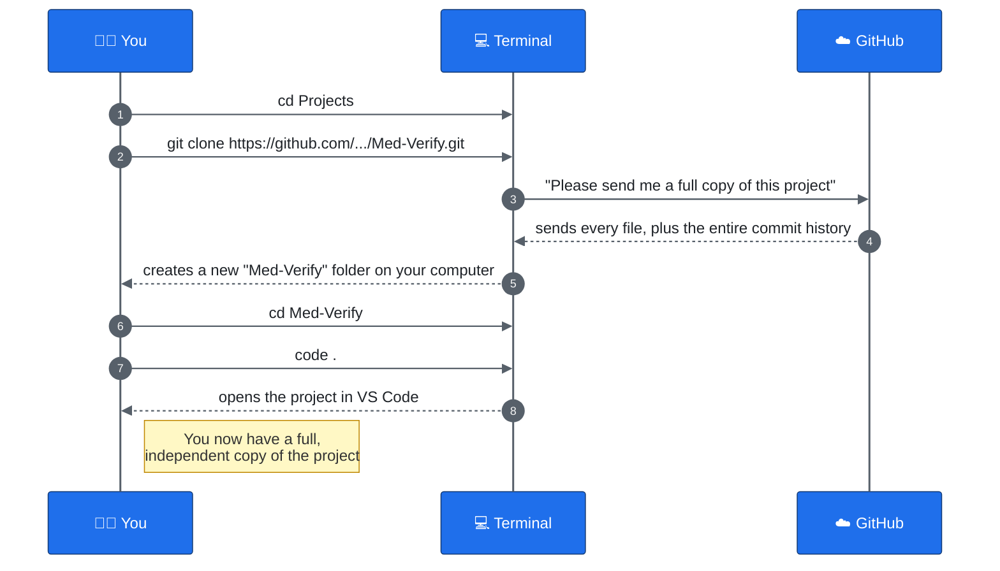

# 02 — Getting the Project Onto Your Computer

This is the stuff you do **once**, the very first time you start working on the project. You won't repeat these steps every day.

## Before you start: a checklist

You need three things ready:

1. **Git installed** on your computer. (Ask an adult to help you install it from [git-scm.com](https://git-scm.com) if it isn't already.)
2. **A GitHub account.**
3. **Permission to see the project.** Someone (like a teacher or the project owner) needs to add your GitHub account as a **collaborator** on the repository, or the repository needs to be public. If you try to clone and get an error about permission, this is usually why — ask the project owner to add you.
4. **Git needs to know who you are.** The very first time you use Git on a computer, tell it your name and email — Git stamps every commit you make with this, so your teammates know who did what.

```bash
git config --global user.name "Your Name"
git config --global user.email "your.email@example.com"
```

You only need to do this **once per computer**, not once per project.

## Step 1 — Find the project's Git URL

On GitHub, open the repository's page and click the green **Code** button. Copy the URL it shows you — it'll look something like:

```
https://github.com/some-username/Med-Verify.git
```

## Step 2 — Open a terminal

A terminal (also called a command line) is a place where you type commands instead of clicking buttons. On most setups you'll use **VS Code's built-in terminal**: open VS Code, then go to the top menu → **Terminal → New Terminal**.

## Step 3 — Go to the folder where you want the project to live

Decide where on your computer you want this project folder to sit — for example, a folder called `Projects`. Use `cd` (which means "change directory") to go there:

```bash
cd Projects
```

## Step 4 — Clone the repository

This is the big one. `git clone` downloads the **entire project, plus its whole history**, onto your computer:

```bash
git clone https://github.com/some-username/Med-Verify.git
```

When it finishes, you'll see a new folder named `Med-Verify` sitting inside `Projects`. That's your very own full copy of the project.

## Step 5 — Go into the project and open it

```bash
cd Med-Verify
```

Then open the folder in VS Code (if you're not already there):

```bash
code .
```

(The `.` means "this folder, right here.")

## The picture: what just happened



## How do I know it worked?

Run this inside the `Med-Verify` folder:

```bash
git status
```

You should see something like:

```
On branch main
Your branch is up to date with 'origin/main'.
nothing to commit, working tree clean
```

That message means: "everything on your computer exactly matches what's on GitHub." That's exactly what you want right after a clone.

## Common problems

| What you see | What it means | What to do |
|---|---|---|
| `Repository not found` | GitHub says you don't have permission, or you typed the URL wrong | Double-check the URL; ask the project owner to add you as a collaborator |
| `git: command not found` | Git isn't installed | Install Git, then restart your terminal |
| `fatal: destination path 'Med-Verify' already exists` | You already cloned it before | You don't need to clone again — just `cd` into the existing folder |

**Next:** [03 — Your Everyday Workflow](03-everyday-workflow.md) — what you do every single day after this.
