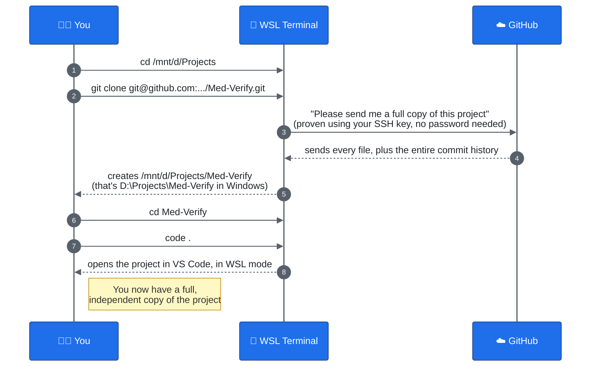

# 02 — Getting the Project Onto Your Computer

This is the stuff you do **once**, the very first time you start working on the project. You won't repeat these steps every day.

**Everything in this file happens inside a WSL terminal.** If you haven't read [file 00](00-wsl-and-terminal-basics.md) yet, do that first — it explains what WSL is, how Windows paths like `D:\Projects` map to Linux paths like `/mnt/d/Projects`, and the basic commands (`cd`, `ls`, `pwd`) used below.

## Before you start: a checklist

You need these ready:

1. **Git installed** inside your WSL environment. (Ask an adult to help if it isn't already — it's usually already included.)
2. **A GitHub account.**
3. **Permission to see the project.** Someone (like a teacher or the project owner) needs to add your GitHub account as a **collaborator** on the repository, or the repository needs to be public. If you try to clone and get an error about permission, this is usually why — ask the project owner to add you.
4. **An SSH key added to your GitHub account.** This project uses SSH (not the `https://` link) to clone and push, so GitHub can recognize your computer without asking for a password every time. If you're following this guide as one of the students on this project, you should already have this set up — if you're not sure, ask whoever set up your computer.
5. **Git needs to know who you are.** The very first time you use Git inside WSL, tell it your name and email — Git stamps every commit you make with this, so your teammates know who did what.

```bash
git config --global user.name "Your Name"
git config --global user.email "your.email@example.com"
```

You only need to do this **once per computer**, not once per project.

## Step 1 — Find the project's Git URL

On GitHub, open the repository's page and click the green **Code** button. You'll see a couple of tabs — make sure **SSH** is selected (not HTTPS), then copy the URL it shows you. It'll look something like:

```
git@github.com:some-username/Med-Verify.git
```

**Why SSH and not HTTPS?** With an SSH key already added to your GitHub account, Git can prove it's really you without typing a password every single time you push. The `git@github.com:...` format (instead of `https://github.com/...`) is how you tell Git to use that SSH connection.

## Step 2 — Open a WSL terminal

Open **Windows Terminal** and start a **WSL tab** (not a plain Windows PowerShell one) — see [file 00](00-wsl-and-terminal-basics.md) if you need a reminder of how.

## Step 3 — Go to the folder where you want the project to live

You'll typically want your projects to live somewhere on your `D:` drive so they're easy to find from Windows too. Remember from file 00: `D:\Projects` in Windows is `/mnt/d/Projects` in WSL. Use `cd` to go there:

```bash
cd /mnt/d/Projects
```

If that `Projects` folder doesn't exist yet, create it first with `mkdir Projects`, then `cd` into it.

## Step 4 — Clone the repository

This is the big one. `git clone` downloads the **entire project, plus its whole history**, onto your computer:

```bash
git clone git@github.com:some-username/Med-Verify.git
```

When it finishes, you'll see a new folder named `Med-Verify` sitting inside `/mnt/d/Projects`. That's your very own full copy of the project — and since it's under `/mnt/d/...`, it physically lives on your `D:` drive, at `D:\Projects\Med-Verify`, even though you're working with it from WSL.

## Step 5 — Go into the project and open it

```bash
cd Med-Verify
pwd
```

That `pwd` should print `/mnt/d/Projects/Med-Verify`. Then open the folder in VS Code, in WSL mode:

```bash
code .
```

(The `.` means "this folder, right here.") Check the bottom-left corner of VS Code for the green **"WSL: Ubuntu"** badge, confirming it opened correctly — see file 00 for why that matters.

## The picture: what just happened



## How do I know it worked?

Run this inside the `Med-Verify` folder:

```bash
git status
```

You should see something like:

```
On branch main
Your branch is up to date with 'origin/main'.
nothing to commit, working tree clean
```

That message means: "everything on your computer exactly matches what's on GitHub." That's exactly what you want right after a clone.

## Common problems

| What you see | What it means | What to do |
|---|---|---|
| `Repository not found` | GitHub says you don't have permission, or you typed the URL wrong | Double-check the URL; ask the project owner to add you as a collaborator |
| `git: command not found` | Git isn't installed | Install Git, then restart your terminal |
| `fatal: destination path 'Med-Verify' already exists` | You already cloned it before | You don't need to clone again — just `cd` into the existing folder |
| `Permission denied (publickey)` | Your SSH key isn't set up, or isn't added to your GitHub account yet | Ask whoever set up your computer to help add your SSH key to GitHub — don't try to fix this alone the first time |
| `Are you sure you want to continue connecting?` | Your computer is meeting GitHub's server for the first time over SSH | This is normal the very first time — type `yes` and press Enter |

**Next:** [03 — Your Everyday Workflow](03-everyday-workflow.md) — what you do every single day after this.
