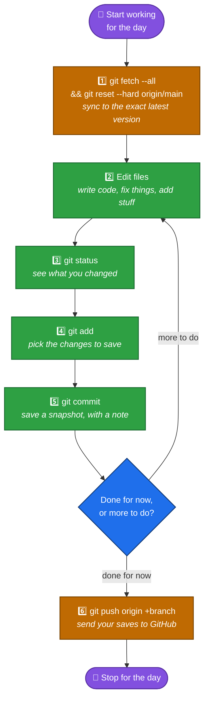

# 03 — Your Everyday Workflow

You already cloned the project once ([file 02](02-first-time-setup.md)). Now here's the loop you'll repeat **every time** you sit down to work on it, and again **every time** you finish a piece of work.

**This project uses a specific set of commands, on purpose** — not the "default" ones you might see in other Git tutorials. Follow the exact commands in this file, even if you later read something different somewhere else.

## The Golden Loop



Let's walk through every step for real.

## ⚠️ Read this before Step 1

Step 1 uses a command that **permanently deletes** any work you haven't saved yet. Before you ever run it, make sure you've `git add`ed, `git commit`ed, **and pushed** everything you care about from your last session. If you're not sure, run `git status` first — if it says `nothing to commit, working tree clean`, you're safe.

## Step 1 — Sync to the exact latest version

Someone else on your team might have pushed new changes since you last worked. This project doesn't use `git pull` — instead, you run two commands together, every time you start working:

```bash
git fetch --all
git reset --hard origin/main
```

What each one does:

- `git fetch --all` — downloads the latest information from GitHub, but doesn't change any of your files yet. It's like checking the mailbox without opening the mail.
- `git reset --hard origin/main` — makes your local project **exactly match** what's on GitHub's `main` branch right now, throwing away anything different on your computer.

**Why "reset --hard" instead of "pull"?** A regular `git pull` tries to cleverly *combine* your changes with everyone else's, which can lead to confusing "merge conflicts" — hard to untangle when you're just starting out. This project avoids that entirely: you always start each session from the exact same clean copy as everyone else. The trade-off is that this command is **destructive** — that's exactly why the warning above exists.

## Step 2 — Make your changes

Open files, edit code, save your work — just like you normally would in VS Code. Git doesn't do anything automatically here; it's quietly watching in the background.

## Step 3 — Check what you changed with `git status`

This is the single most useful command in Git. Run it constantly — before you add, before you commit, whenever you're not sure what's going on:

```bash
git status
```

You'll see something like:

```
On branch main
Changes not staged for commit:
  modified:   Requirements/REQ-01-input-classification.md

Untracked files:
  Requirements/REQ-18-new-idea.md
```

This tells you two things:
- **Modified** files: files that already existed and you changed.
- **Untracked** files: brand new files Git has never seen before.

## Step 4 — `add` the changes you want to save

Before you can commit, you have to tell Git *which* changes to include — this is called **staging**. Think of it like putting items in a shopping basket before checking out.

```bash
git add Requirements/REQ-01-input-classification.md
```

Want to stage everything you changed at once?

```bash
git add .
```

Run `git status` again — the files you staged now show up under `Changes to be committed`.

## Step 5 — `commit` your staged changes

This actually creates the save point. Every commit needs a short message explaining what you did:

```bash
git commit -m "mv: fix typo in REQ-01"
```

**This project uses a specific commit message style** — always follow it:

- **Title**: `mv: <short description>`, under 40 characters.
- **Body** (if you need more detail): one line per point, each starting with `-`, under 80 characters.

Example with a body:

```bash
git commit -m "$(cat <<'EOF'
mv: add REQ-18 for barcode scanning

- New requirement for scanning barcodes
- Links to REQ-02 medicine identification
EOF
)"
```

Why bother with a good message? Six months from now, someone (maybe you!) will run `git log` and need to understand what each commit did *without* re-reading all the code.

## Step 6 — `push` your commits to GitHub

Your commits so far only exist on **your own computer**. Nobody else can see them until you push. There are two different commands, depending on whether this is the *first* time you're pushing this branch or not:

**The very first push of a branch** (Git doesn't yet know where on GitHub this branch belongs):

```bash
git push origin <local_branch_name>
```

**Every push after that** (this project always uses a force push here):

```bash
git push origin +<local_branch_name>
```

The `+` in front of the branch name means "force this push through, and make GitHub's copy match mine exactly" — even if that overwrites something. Combined with Step 1 (you always start from the latest version before making changes), this keeps pushing simple and avoids Git asking you to merge things.

**⚠️ Force pushing is powerful — use it thoughtfully.** It can overwrite commits that someone else already pushed if you're not both working from the same starting point. If you're working on a shared branch with teammates, always run Step 1 immediately before you push, and talk to your team about who's pushing when.

## Quick reference: the three "levels" of a change

A lot of beginners get confused about why there are three separate steps (`add`, `commit`, `push`) instead of just one. Here's the picture again, zoomed in:


Each step is a checkpoint you control on purpose — you might edit 5 files but only want to stage and commit 2 of them right now, and you might make 3 separate commits before you push all of them at once.

## Common problems

| What you see | What it means | What to do |
|---|---|---|
| `Your branch is ahead of 'origin/main' by 1 commit` | You committed but haven't pushed yet | Run `git push origin +<branch>` (or `git push origin <branch>` if it's your first push) |
| `nothing to commit, working tree clean` | You have no changes yet, or you already committed everything | You're safe to run the Step 1 sync command |
| `fatal: The current branch has no upstream branch` | This is your first-ever push of this branch | Use the first-push form: `git push origin <branch>` (no `+`) |
| You realize you have uncommitted work **right before** running Step 1 | `git reset --hard` is about to delete it | Stop — run `git add`, `git commit`, and push first, *then* run Step 1 |

**Next:** [04 — Branching & Working With Others](04-branching-and-teamwork.md) — how you and a teammate work on different things at the same time without stepping on each other.
