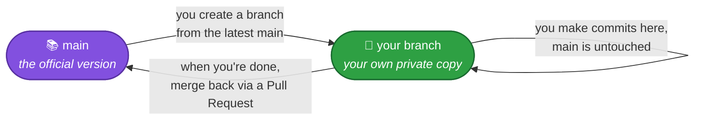
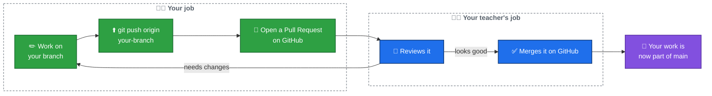
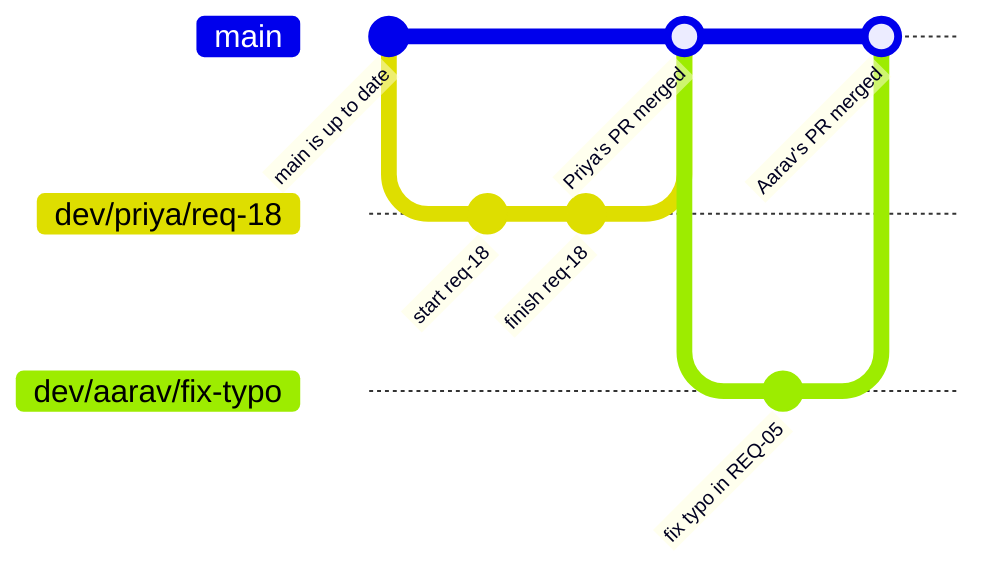

# 04 — Branching & Working With Others

So far you've learned how to work on the project **by yourself**. But real projects have multiple people working at the same time. This file explains **branches** — the tool Git gives you so that two (or ten) people can all work at once without wrecking each other's progress.

## What is a branch?

Imagine `main` is the **official, working version** of the project — the one everyone agrees is correct. Now imagine you want to try something new, like adding a new requirement document, but you're not 100% sure it'll turn out right yet.

A **branch** is your own private copy of the project where you can make changes, completely separately from `main`, until you're ready to bring your work back in.

Think of it like a **group Google Doc**, but instead of everyone editing the same page at once (and stepping on each other's cursors), each person duplicates the page, edits their own copy, and then a teacher merges the finished copies back into the original — one at a time, carefully.



## Why bother with branches at all?

- **`main` always stays safe.** Nobody's half-finished, possibly-broken work ever sits directly on `main` — it only arrives once it's done and reviewed.
- **Everyone can work at the same time.** You and a teammate can be editing completely different (or even the same!) files without either of you blocking the other.
- **Mistakes are contained.** If your branch has a bug, it only affects your branch — `main`, and everyone else's branches, are unaffected until you merge.

## The branch you'll actually use

In this project, each student works on their **own personal branch**, usually named something like:

```
dev/<your-initials>/<what-you're-working-on>
```

For example: `dev/sm/req-18-barcode-scanning`. You'll create this once, and can keep reusing it across many work sessions — every session, you'll sync it to the latest `main` (from [file 03](03-everyday-workflow.md)) before continuing.

## Creating your branch

The first time you start a new piece of work, create your branch **from the latest `main`**:

```bash
git fetch --all
git reset --hard origin/main
git checkout -b dev/sm/req-18-barcode-scanning
```

- The first two lines are the same sync step you already know from file 03 — make sure you're starting from the latest version.
- `git checkout -b <name>` creates a brand new branch with that name, and switches you onto it, in one step.

From here, everything from [file 03](03-everyday-workflow.md) works exactly the same — edit, `git status`, `git add`, `git commit` — except your first push uses your branch's name:

```bash
git push origin dev/sm/req-18-barcode-scanning
```

## Turning your branch into a Pull Request

Once you've pushed your branch, go to the repository on GitHub. You'll usually see a yellow banner offering to **"Compare & pull request"** for your branch — click it. (If you don't see it, click the **Pull requests** tab, then **New pull request**, and pick your branch.)

A **Pull Request** (PR for short) is a request that says: *"Here's the work on my branch — please review it and merge it into `main`."*

1. Give it a short title and description of what you did.
2. Click **Create pull request**.

**That's it — that's the end of your job for this task.** In this project, **your teacher handles all reviewing and merging**. You never need to click a "Merge" button yourself, and you shouldn't try to. Once your Pull Request is created, your teacher will look at it, and either merge it in or leave comments asking for changes.



**Important**: in this project, merging always happens **on the GitHub website**, and it's always your teacher who does it — never you, and never by running merge commands yourself on your computer.

## How two people work together, side by side

Here's what it looks like when two students, Priya and Aarav, both work on the project at the same time, each on their own branch:



Notice: Priya's branch and Aarav's branch never touch each other directly. They each branch off `main`, do their own work, and open a Pull Request when they're done. The two `merge` points shown here are your teacher's action on GitHub, not something either student did themselves. Neither of them was ever blocked waiting for the other.

## What if they both changed the same lines?

If Priya and Aarav happen to edit the **exact same lines of the exact same file**, your teacher will see a **merge conflict** when trying to merge the second Pull Request — Git can't automatically decide whose change should win.

**This is not your problem to solve.** If your teacher tells you your Pull Request has a conflict, it just means your branch needs updating before it can be merged — don't try to fix it by yourself with commands you're unsure about. Ask your teacher what they'd like you to do.

## ⚠️ One important caution about this project's branch style

Because Step 1 of your daily workflow (`git fetch --all && git reset --hard origin/main`) resets your branch to match `main`, you should **not** run it again on a branch that has an **open, not-yet-merged** Pull Request. Doing so will make your local branch "forget" those commits (they're still sitting on GitHub, on your open PR, until you push again — but if you then push again, you could overwrite that PR with something that doesn't match what was being reviewed).

**The safe rule:** finish your task, push, and let your Pull Request get merged **before** you sync that same branch again. If you need to start a completely different task while a PR is still waiting for review, create a **new** branch for it instead of reusing the same one.

**Next:** [05 — Cheat Sheet](05-cheat-sheet.md) — keep this open while you work.
