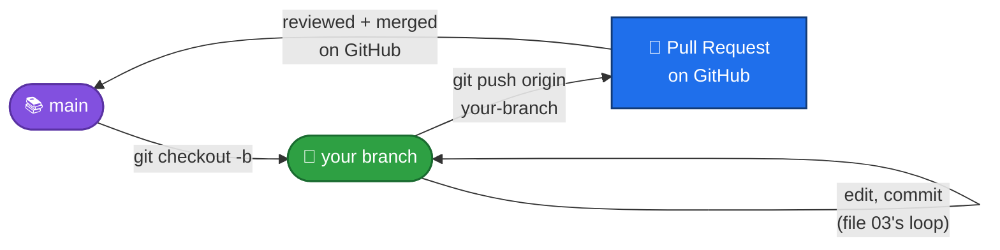
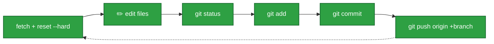

# 05 — Cheat Sheet

Keep this page open in a tab while you work. It's a quick reminder, not a full explanation — if something doesn't make sense, go back to [01](01-what-is-git-and-github.md), [02](02-first-time-setup.md), [03](03-everyday-workflow.md), or [04](04-branching-and-teamwork.md).

## The commands you'll use constantly

| Command | What it does |
|---|---|
| `git status` | Shows what's changed. Run this **all the time** — it never breaks anything. |
| `git fetch --all`<br/>`git reset --hard origin/main` | Syncs your project to exactly match GitHub. Run this **before** you start working. ⚠️ Deletes any uncommitted changes — commit and push first! |
| `git add <file>` | Stages one file (picks it to be saved next). |
| `git add .` | Stages **everything** you changed. |
| `git commit -m "message"` | Saves a snapshot of everything staged, with a note. |
| `git push origin <branch>` | **First-ever push** of a branch. |
| `git push origin +<branch>` | Every push after the first — sends your commits to GitHub, force-overwriting what's there. |

## The commands you'll use once in a while

| Command | What it does |
|---|---|
| `git clone <ssh-url>` | Downloads a full copy of a project. You only do this **once**, ever, per computer. |
| `git checkout -b <branch>` | Creates a new branch and switches you onto it, in one step. |
| `git branch` | Lists your local branches, and shows which one you're currently on. |
| `git log` | Shows the history of commits, newest first. |
| `git log --oneline` | Same thing, but one short line per commit — easier to scan. |
| `git diff` | Shows the *exact* lines you changed, before you stage them. |

## Branching & teamwork, in one picture



See [file 04](04-branching-and-teamwork.md) for the full explanation, including the important caution about not re-syncing a branch that has an open, unmerged Pull Request.

## The one loop to remember



Sync → Edit → Status → Add → Commit → Push. Repeat.

## Commit message format for this project

```
mv: <short title, under 40 characters>

- one bullet per point
- each line under 80 characters
- prefer several short bullets over one paragraph
```

## If you're ever stuck

1. Run `git status` first — it usually tells you exactly what to do next, in its own message.
2. This project's own workflow uses `git reset --hard` and force push (`+branch`) on purpose — that's fine, as long as you follow the exact order in [file 03](03-everyday-workflow.md) (commit and push *before* you sync). But don't improvise with **other** reset/force/clean commands you find online just because they might "fix" something — anything in that family can delete work permanently if used differently than what's taught here.
3. Ask for help. Every single Git user, no matter how experienced, has been stuck exactly where you are.
