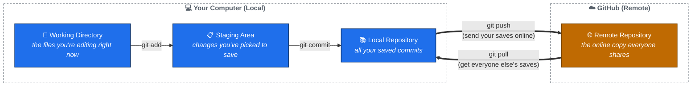

# What is Git and GitHub?

## Start with a video game analogy

You know how in a video game, you can **save your progress**? Later, if you mess up, you can **load** that save and try again?

Git is like a save system, but for code:

- Every time you finish a small piece of work, you tell Git "save this" — this is called a **commit**.
- Git remembers *every* save you've ever made, in order, forever.
- You can always go back and look at (or even restore) an old save.

The difference from a video game: instead of one save file, Git keeps a whole **history** of saves, and it can show you exactly *what changed* between any two of them.

## So what's GitHub, then?

Git and GitHub are **two different things** that are easy to mix up:

| | What it is |
|---|---|
| **Git** | A tool installed on your computer that creates and manages the "saves" (commits). |
| **GitHub** | A website that stores a copy of your project — and all its saves — on the internet. |

Think of it like this: Git is like the "Save Game" button. GitHub is like a locker in the cloud where a copy of your save file also lives, so you don't lose it if your computer breaks, and so your teammates can grab the same save.

## The picture

Don't worry about memorizing `git add`, `git commit`, `git push`, and `git pull` right now — you'll type them for real in the next two files, and it'll click quickly. For now, just remember the shape of the picture:

**Your files → picked for saving → saved → sent online → shared with everyone.**

## Key words, explained simply

| Word | What it really means |
|---|---|
| **Repository** (or "repo") | A project folder that Git is keeping track of. |
| **Commit** | One saved snapshot of your work, with a short note describing what you changed. |
| **Clone** | Downloading a full copy of a repository (with all its history) onto your computer. You do this **once**, at the start. |
| **Staging Area** | A holding area where you put the changes you're about to save, before you actually save them. |
| **Push** | Sending your saved commits from your computer up to GitHub. |
| **Pull** | Downloading commits that other people have pushed to GitHub, and combining them into your own work. |
| **Branch** | A separate line of work, so you can make changes without disturbing the "official" version. Covered in depth in file 04. |
| **Status** | Asking Git "what's changed since my last save?" — you'll run this constantly. |

## Why do we even bother with all this?

Imagine you and a friend are both editing the same document with no save history:

- If you both make changes, whose version wins?
- If something breaks, which of the last 20 edits caused it?
- If your laptop dies, is your work gone forever?

Git solves all three: everyone's changes get combined in an organized way, you can find exactly which commit introduced a bug, and GitHub keeps a safe copy online.

**Next:** [02 — Cloning a Repository](02-cloning-a-repo.md)
