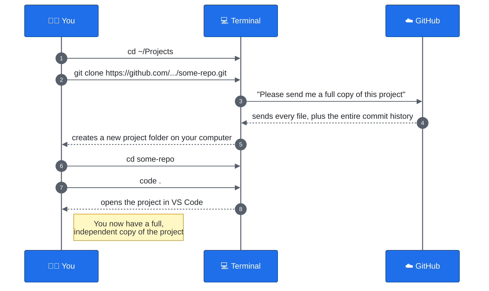

# Cloning a Repository

This is the stuff you do **once**, the very first time you start working on an existing project. You won't repeat these steps every day.

## Before you start: a checklist

1. **Git installed** on your computer.
2. **A GitHub account.**
3. **Permission to see the project.** Someone needs to add your GitHub account as a **collaborator** on the repository, or the repository needs to be public. If you try to clone and get an error about permission, this is usually why.
4. **Git needs to know who you are.** The very first time you use Git on a computer, tell it your name and email — Git stamps every commit you make with this, so your teammates know who did what.

```bash
git config --global user.name "Your Name"
git config --global user.email "your.email@example.com"
```

You only need to do this **once per computer**, not once per project.

## Step 1 — Find the project's Git URL

On GitHub, open the repository's page and click the green **Code** button. You'll see two tabs, **HTTPS** and **SSH**:

- **HTTPS** looks like `https://github.com/some-username/some-repo.git` — simplest to start with, but GitHub will ask for a login every so often.
- **SSH** looks like `git@github.com:some-username/some-repo.git` — requires an SSH key set up on your GitHub account first, but then never asks for a password again.

Either works. Copy whichever URL matches the option you've set up.

## Step 2 — Open a terminal

A terminal (also called a command line) is where you type commands instead of clicking buttons. (If you're working inside WSL, see the [WSL mini-course](../WSL/README.md) for how to open one and how paths work there.)

## Step 3 — Go to the folder where you want the project to live

Decide where on your computer you want this project folder to sit, and `cd` there:

```bash
cd ~/Projects
```

## Step 4 — Clone the repository

This is the big one. `git clone` downloads the **entire project, plus its whole history**, onto your computer:

```bash
git clone https://github.com/some-username/some-repo.git
```

(Or the `git@github.com:...` form, if you're using SSH.)

When it finishes, you'll see a new folder — named after the repository — sitting inside wherever you ran the command. That's your very own full copy of the project.

## Step 5 — Go into the project and open it

```bash
cd some-repo
code .
```

(The `.` means "this folder, right here." See the [VS Code mini-course](../VSCode/README.md) if you haven't used `code .` before.)

## The picture: what just happened



## How do I know it worked?

Run this inside the project folder:

```bash
git status
```

You should see something like:

```
On branch main
Your branch is up to date with 'origin/main'.
nothing to commit, working tree clean
```

That message means: "everything on your computer exactly matches what's on GitHub." That's exactly what you want right after a clone.

## Common problems

| What you see | What it means | What to do |
|---|---|---|
| `Repository not found` | GitHub says you don't have permission, or you typed the URL wrong | Double-check the URL; ask the project owner to add you as a collaborator |
| `git: command not found` | Git isn't installed | Install Git, then restart your terminal |
| `fatal: destination path '...' already exists` | You already cloned it before | You don't need to clone again — just `cd` into the existing folder |
| `Permission denied (publickey)` | You tried the SSH URL, but don't have an SSH key set up yet | Either set up an SSH key on your GitHub account, or use the HTTPS URL instead |

**Next:** [03 — Your Everyday Workflow](03-everyday-workflow.md) — what you do every single day after this.
