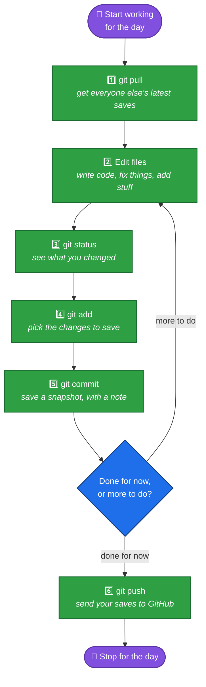
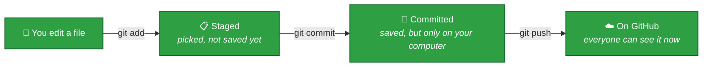

# Your Everyday Workflow

You already cloned the project once ([file 02](02-cloning-a-repo.md)). Now here's the loop you'll repeat **every time** you sit down to work on it, and again **every time** you finish a piece of work.

## The Golden Loop



Let's walk through every step for real.

## Step 1 — Always `pull` before you start working

Someone else on your team might have pushed new changes since you last worked. Grab them first, so you're never working on an old version:

```bash
git pull
```

If nothing's changed, Git tells you `Already up to date.` — that's fine, it just means you were already current. If you had uncommitted changes that would conflict with incoming ones, Git will tell you to commit or discard them first — see the troubleshooting table below.

## Step 2 — Make your changes

Open files, edit code, save your work — just like you normally would. Git doesn't do anything automatically here; it's quietly watching in the background.

## Step 3 — Check what you changed with `git status`

This is the single most useful command in Git. Run it constantly — before you add, before you commit, whenever you're not sure what's going on:

```bash
git status
```

You'll see something like:

```
On branch main
Changes not staged for commit:
  modified:   src/app.js

Untracked files:
  src/new-feature.js
```

This tells you two things:
- **Modified** files: files that already existed and you changed.
- **Untracked** files: brand new files Git has never seen before.

## Step 4 — `add` the changes you want to save

Before you can commit, you have to tell Git *which* changes to include — this is called **staging**. Think of it like putting items in a shopping basket before checking out.

```bash
git add src/app.js
```

Want to stage everything you changed at once?

```bash
git add .
```

Run `git status` again — the files you staged now show up under `Changes to be committed`.

## Step 5 — `commit` your staged changes

This actually creates the save point. Every commit needs a short message explaining what you did:

```bash
git commit -m "Fix off-by-one error in pagination"
```

A good commit message explains *what* changed and, ideally, *why* — future you (and your teammates) will read these messages instead of re-reading all the code every time they need to understand history. Keep the first line short (under ~50-70 characters is a common guideline) and add more detail below it if needed.

## Step 6 — `push` your commits to GitHub

Your commits so far only exist on **your own computer**. Nobody else can see them until you push:

```bash
git push
```

Now your teammates can `git pull` and get your changes too.

## Quick reference: the three "levels" of a change

A lot of beginners get confused about why there are three separate steps (`add`, `commit`, `push`) instead of just one. Here's the picture again, zoomed in:



Each step is a checkpoint you control on purpose — you might edit 5 files but only want to stage and commit 2 of them right now, and you might make 3 separate commits before you push all of them at once.

## Common problems

| What you see | What it means | What to do |
|---|---|---|
| `Your branch is ahead of 'origin/main' by 1 commit` | You committed but haven't pushed yet | Run `git push` |
| `nothing to commit, working tree clean` | You have no changes yet, or you already committed everything | Nothing to do — you're caught up |
| `Please commit your changes or stash them before you merge` (during `git pull`) | You have unsaved changes that would get overwritten | Run `git add` and `git commit` first, then `git pull` again |
| A confusing "merge conflict" message | You and someone else changed the *same lines* of the *same file* | Don't panic — stop and ask for help the first few times this happens |

**Next:** [04 — Branching & Working With Others](04-branching-and-teamwork.md)
