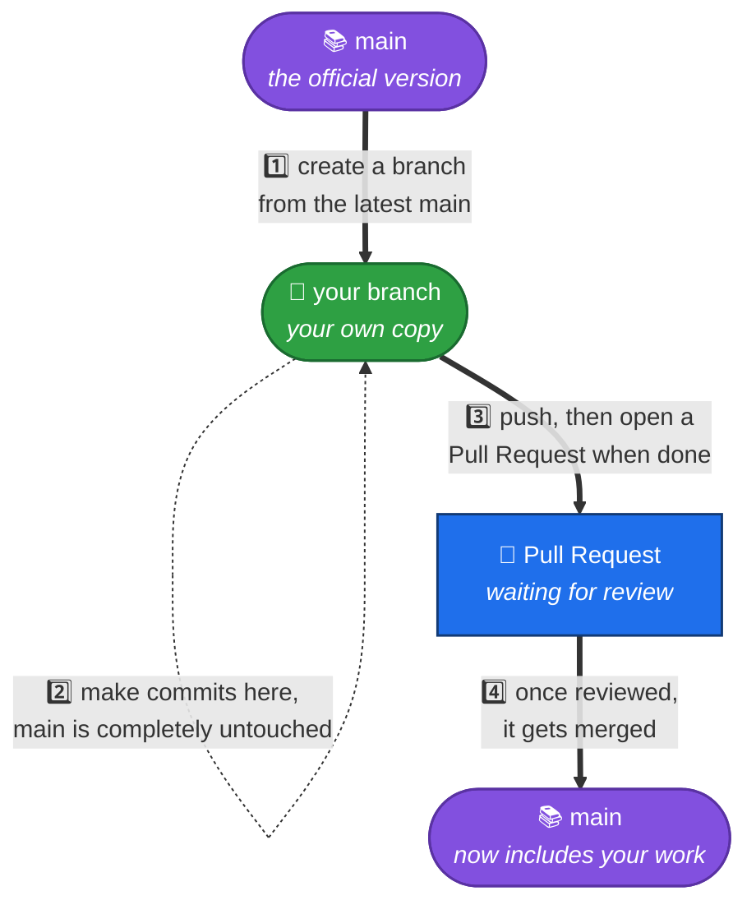
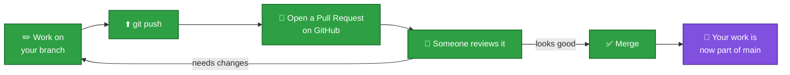
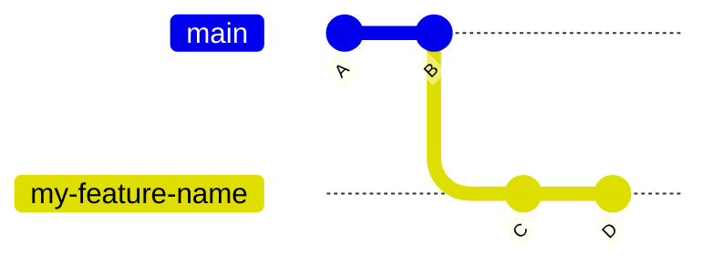
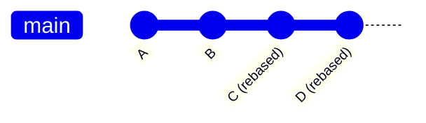
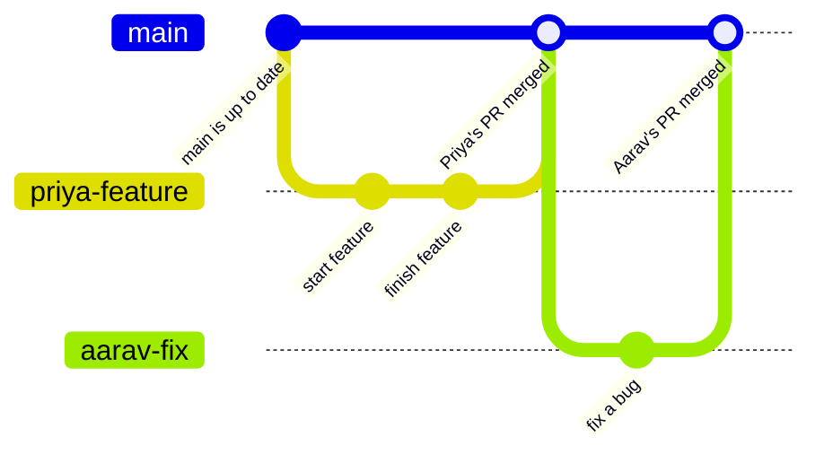

# Branching & Working With Others

So far you've learned how to work on a project **by yourself**. But real projects have multiple people working at the same time. This file explains **branches** — the tool Git gives you so that two (or ten) people can all work at once without wrecking each other's progress.

## What is a branch?

Imagine `main` is the **official, working version** of the project — the one everyone agrees is correct. Now imagine you want to try something new, but you're not 100% sure it'll turn out right yet.

A **branch** is your own copy of the project where you can make changes, completely separately from `main`, until you're ready to bring your work back in.

Think of it like a **group Google Doc**, but instead of everyone editing the same page at once (and stepping on each other's cursors), each person duplicates the page, edits their own copy, and then the finished copies get combined back into the original — one at a time, carefully.



## Why bother with branches at all?

- **`main` always stays safe.** Nobody's half-finished, possibly-broken work ever sits directly on `main` — it only arrives once it's done and reviewed.
- **Everyone can work at the same time.** You and a teammate can be editing completely different (or even the same!) files without either of you blocking the other.
- **Mistakes are contained.** If your branch has a bug, it only affects your branch — `main`, and everyone else's branches, are unaffected until you merge.

## Creating a branch

```bash
git pull
git checkout -b my-feature-name
```

- `git pull` first, so your new branch starts from the latest version of `main`.
- `git checkout -b <name>` creates a brand new branch with that name, and switches you onto it, in one step.

Many teams use a naming convention for branches, like `feature/<short-description>` or `<your-name>/<task>` — check what convention your own project uses.

From here, everything from [file 03](03-everyday-workflow.md) works exactly the same — edit, `git status`, `git add`, `git commit` — except your first push needs to name your branch explicitly, since GitHub doesn't know about it yet:

```bash
git push -u origin my-feature-name
```

(The `-u` tells Git to remember this connection, so future plain `git push` commands on this branch know where to go.)

## Turning your branch into a Pull Request

Once you've pushed your branch, go to the repository on GitHub. You'll usually see a banner offering to **"Compare & pull request"** for your branch — click it. (If you don't see it, click the **Pull requests** tab, then **New pull request**, and pick your branch.)

A **Pull Request** (PR for short) is a request that says: *"Here's the work on my branch — please review it and merge it into `main`."*

1. Give it a short title and description of what you did.
2. Click **Create pull request**.
3. Someone reviews your changes on the PR page — they can leave comments, ask for changes, or approve it.
4. Once approved, the PR gets merged into `main`.



**Who actually clicks "Merge"?** That depends entirely on the project's own rules — some projects let any contributor merge their own approved PR, others reserve merging for a project maintainer or teacher. Always check what your specific project expects.

## GitHub's three ways to merge a Pull Request

When someone does click merge, GitHub actually offers **three different strategies**. It's worth knowing all three, since projects differ in which one they use:

| Strategy | What it does |
|---|---|
| **Create a merge commit** | Keeps both histories exactly as they were, and adds one new "merge commit" joining them together. You'll see a branching, diamond-shaped history. |
| **Squash and merge** | Combines *all* of your branch's commits into a single new commit on `main`, as if you'd made just one change. |
| **Rebase and merge** | Takes each of your branch's commits and replays them, one by one, directly on top of the latest `main` — keeping them as separate commits, but producing a straight, linear history with no merge commit. |

Here's "Rebase and merge" specifically, shown as before/after — your branch has two commits (`C` and `D`) that don't exist on `main` yet:



After a rebase-and-merge, `main` looks like this — one straight line, no merge commit, but `C` and `D` are still two separate commits (they've just been given new commit hashes, since they were technically re-created on top of `main`):



There's no universally "correct" choice between the three — different teams prefer different history styles. Again, check what your specific project uses.

## How two people work together, side by side

Here's what it looks like when two people, Priya and Aarav, both work on a project at the same time, each on their own branch:



Notice: Priya's branch and Aarav's branch never touch each other directly. They each branch off `main`, do their own work, and merge back into `main` one at a time. Neither of them was ever blocked waiting for the other.

## What if they both changed the same lines?

If Priya and Aarav happen to edit the **exact same lines of the exact same file**, GitHub will notice when the second Pull Request tries to merge, and will show a **merge conflict** — it can't automatically decide whose change should win.

This is normal and not a disaster. When it happens:

1. Don't panic, and don't guess.
2. Look at both versions of the conflicting lines — Git marks them clearly, showing "yours" and "theirs" side by side.
3. Decide (or ask a teammate/reviewer to help decide) what the final, combined version should say, then save that as the resolution.

**Next:** [Exercises](exercises.md) — practice branching and merging for yourself.
