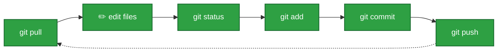
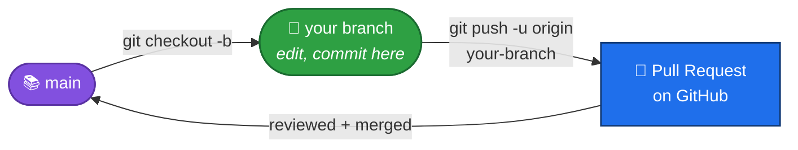

# Cheat Sheet

Keep this page open in a tab while you work. It's a quick reminder, not a full explanation — if something doesn't make sense, go back to [01](01-what-is-git-and-github.md), [02](02-cloning-a-repo.md), [03](03-everyday-workflow.md), or [04](04-branching-and-teamwork.md).

## The commands you'll use constantly

| Command | What it does |
|---|---|
| `git status` | Shows what's changed. Run this **all the time** — it never breaks anything. |
| `git pull` | Downloads everyone else's latest commits from GitHub, and combines them with yours. Run this **before** you start working. |
| `git add <file>` | Stages one file (picks it to be saved next). |
| `git add .` | Stages **everything** you changed. |
| `git commit -m "message"` | Saves a snapshot of everything staged, with a note. |
| `git push` | Sends your commits up to GitHub, so others can see them. |

## The commands you'll use once in a while

| Command | What it does |
|---|---|
| `git clone <url>` | Downloads a full copy of a project. You only do this **once**, ever, per computer. |
| `git init` | Turns the current folder into a brand-new Git repository. |
| `git checkout -b <branch>` | Creates a new branch and switches you onto it, in one step. |
| `git checkout <branch>` | Switches to an existing branch. |
| `git branch` | Lists your local branches, and shows which one you're currently on. |
| `git merge <branch>` | Combines another branch's commits into the one you're currently on. |
| `git log` | Shows the history of commits, newest first. |
| `git log --oneline` | Same thing, but one short line per commit — easier to scan. |
| `git diff` | Shows the *exact* lines you changed, before you stage them. |

## The one loop to remember

Pull → Edit → Status → Add → Commit → Push. Repeat.

## Branching, in one picture

## Writing good commit messages

- Keep the first line short and specific: *what* changed.
- Add more detail below it if the "why" isn't obvious.
- Small, frequent commits are easier to understand (and undo, if needed) than one giant commit.

## If you're ever stuck

1. Run `git status` first — it usually tells you exactly what to do next, in its own message.
2. Don't run a command you don't understand just because it might "fix" something — especially anything with the words `reset`, `force`, or `clean` in it. Those can **delete work permanently**.
3. Ask for help. Every single Git user, no matter how experienced, has been stuck exactly where you are.
