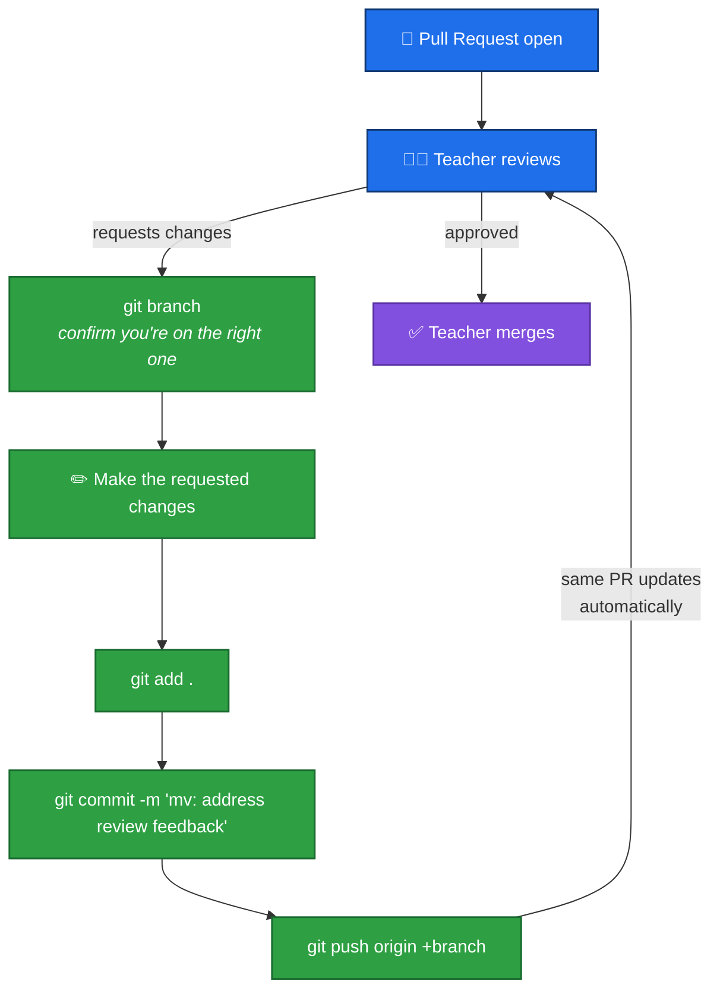
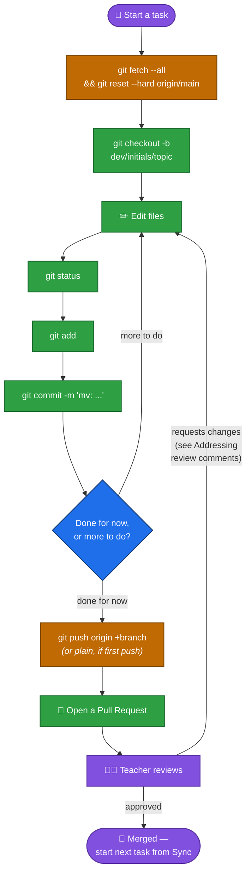

# Working on Med-Verify — Project-Specific Workflow

This page assumes you've already been through the three generic mini-courses in this `Knowledge/` folder:

- **[WSL & Linux Basics](WSL/README.md)**
- **[VS Code Basics](VSCode/README.md)**
- **[Git & GitHub Basics](Git-and-GitHub/README.md)**

Those teach the *standard* way things work. **This page is everything Med-Verify does differently, or more specifically, than the generic default** — read it after, not instead of, the mini-courses above.

## Your environment

- You work **inside WSL**, always — never a plain Windows PowerShell tab. See [WSL 01](WSL/01-what-is-wsl.md) if you need a refresher.
- The project lives on the `D:` drive. In Windows that's `D:\Projects\Med-Verify`; in WSL, that's:

  ```
  /mnt/d/Projects/Med-Verify
  ```

- You open it in VS Code via **Remote Explorer** (connect to your WSL target, then File → Open Folder to your project), and confirm the green **"WSL: Ubuntu"** badge in the bottom-left corner — see [VS Code 02](VSCode/02-vscode-with-wsl.md).

## Cloning: always SSH

Unlike the generic guide (which shows both HTTPS and SSH), **this project always uses SSH**. Your SSH key should already be added to your GitHub account — if you're not sure, ask whoever set up your computer, rather than troubleshooting it alone.

```bash
cd /mnt/d/Projects
git clone git@github.com:some-username/Med-Verify.git
cd Med-Verify
```

## Daily sync: `fetch` + `reset --hard`, not `pull`

The generic guide teaches `git pull` as the normal way to sync. **This project doesn't use `git pull`.** Instead, every time you start working, run:

```bash
git fetch --all
git reset --hard origin/main
```

**⚠️ This is destructive.** `reset --hard` throws away anything on your computer that doesn't match `origin/main` exactly — including any uncommitted work. Before you ever run it, make sure everything you care about from your last session is already committed **and pushed**. If `git status` says `nothing to commit, working tree clean`, you're safe.

**Why this project does it this way:** a regular `git pull` tries to cleverly combine your local history with the remote's, which can produce confusing local merge conflicts. Resetting instead means you always start each session from the exact same clean copy as everyone else — simpler, at the cost of the command being destructive if used carelessly.

## Pushing: two different forms

The generic guide just says `git push`. Here, it depends on whether this is the branch's first push or not:

**First-ever push of a branch:**

```bash
git push origin <local_branch_name>
```

**Every push after that:**

```bash
git push origin +<local_branch_name>
```

The `+` means **force push** — it tells GitHub to make your branch match your local commits exactly, even overwriting what was there. Combined with always resetting before you start (above), this keeps pushing simple.

**⚠️ Use force-push thoughtfully.** It can overwrite a teammate's commits if you're not both working from the same starting point. Always run the sync step immediately before you push, and don't force-push over a branch someone else might currently be adding commits to.

## Branch naming convention

```
dev/<your-initials>/<what-you're-working-on>
```

For example: `dev/sm/req-18-barcode-scanning`.

## Commit message format

```
mv: <short title, under 40 characters>

- one bullet per point
- each line under 80 characters
- prefer several short bullets over one paragraph
```

## Your job ends at the Pull Request

The generic guide says "who clicks merge depends on the project." **On Med-Verify, it's always your teacher — never you.**

1. Push your branch, open a Pull Request on GitHub, give it a title and description.
2. **Stop there.** Don't click Merge, even if GitHub lets you.
3. Your teacher reviews it, and merges it themselves when it's ready.

## Addressing review comments

This is the step where most people new to Git get confused — so read this one carefully. Your teacher leaves comments on your PR asking for changes. Here's exactly what to do, and just as importantly, what **not** to do.

**Do NOT:**
- Run the sync step (`git fetch --all && git reset --hard origin/main`). Your PR's commits aren't in `main` yet — resetting would erase them locally (see the ⚠️ warning below).
- Create a new branch.
- Open a second Pull Request.

**Do this instead:**

1. **Make sure you're on the right branch.** If you closed your terminal or restarted VS Code since opening the PR, check first:

   ```bash
   git branch
   ```

   This lists your branches and marks your current one with a `*`. If you're not on the branch your PR is from, switch to it:

   ```bash
   git checkout dev/sm/req-18-barcode-scanning
   ```

2. **Make the changes your teacher asked for**, directly in the files — same as any normal edit.

3. **Stage and commit, same as always:**

   ```bash
   git status
   git add .
   git commit -m "mv: address review feedback"
   ```

4. **Push again — using the force form**, since this branch already exists on GitHub:

   ```bash
   git push origin +dev/sm/req-18-barcode-scanning
   ```

5. **That's it.** You do **not** need to open a new Pull Request. GitHub automatically shows your new commits on the *same* PR the moment you push — just refresh the PR page and they'll be there, ready for your teacher to look at again.

Repeat this exact loop as many times as needed until your teacher approves and merges it.



## Merging is always "Rebase and merge"

Of the three GitHub merge strategies explained generically in [Git-and-GitHub 04](Git-and-GitHub/04-branching-and-teamwork.md), **this project always uses "Rebase and merge"** — never "Create a merge commit," never "Squash and merge." Practically, that means:

- Your individual commits stay separate in `main`'s history (not squashed into one).
- `main`'s history stays a clean, single straight line — no merge commits.
- Your commits get **new commit hashes** once your teacher merges them, even though the content is identical — this is expected. If you compare your local commit to the one now sitting on GitHub, don't be alarmed that the hash is different.

## ⚠️ Don't re-sync a branch with an open, unmerged Pull Request

Because your daily sync step resets your branch to match `main`, running it again on a branch that still has an **open, unreviewed** Pull Request will make your local branch "forget" those commits (they're still on GitHub until you force-push again — but doing so could overwrite what your teacher is reviewing).

**The safe rule:** finish your task, push, open the PR, and wait for your teacher to merge it **before** you sync that same branch again. If you need to start a different task in the meantime, create a **new** branch for it instead of reusing the same one.

## The Med-Verify Golden Loop, start to finish


