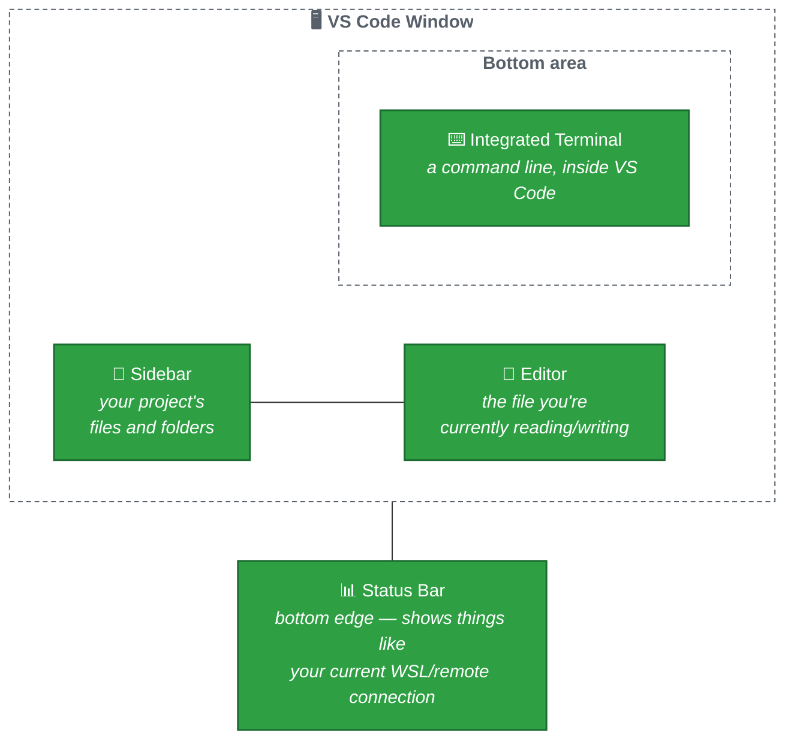

# VS Code Basics

## What is VS Code?

**Visual Studio Code** (almost everyone just says "VS Code") is a free code editor — a program for writing and reading code, similar in spirit to how Microsoft Word is a program for writing documents, but built specifically for programmers.

## The main parts of the window

- **Sidebar** (left) — shows your project's files and folders. Click a file to open it in the editor. This is usually called the **Explorer**.
- **Editor** (middle/right, the big area) — where the actual contents of a file show up for you to read and edit.
- **Integrated Terminal** (bottom, toggle with `` Ctrl+` `` ) — a real command-line terminal, living right inside VS Code, so you don't have to keep switching windows.
- **Status Bar** (very bottom edge) — small but important: it shows things like which folder you have open, and — as you'll see in the next file — whether you're connected to WSL.

## Opening a project folder

VS Code always works best when you open a whole **folder** (your project), not just a single file, so it can see everything at once.

- From inside VS Code: **File → Open Folder...**, then pick your project's folder.
- From a terminal, already sitting inside your project folder: run `code .` (the `.` means "this folder, right here").

## Extensions

VS Code can be extended with **extensions** — small add-ons that add new features (support for a programming language, spell-checking, and so on). You install them from the **Extensions** icon in the very left-hand activity bar (it looks like four small squares). For working with WSL, one extension in particular matters a lot — covered in the next file.

**Next:** [02 — VS Code with WSL](02-vscode-with-wsl.md)
