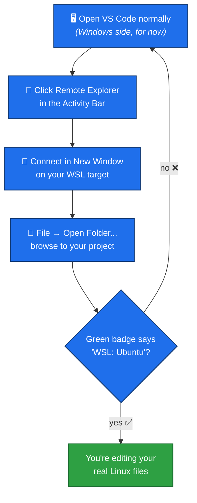

# VS Code with WSL

## The problem

VS Code is a Windows program. Your project's files, if you're working in WSL, actually live in the Linux filesystem (remember `/mnt/d/...` from the [WSL mini-course](../WSL/01-what-is-wsl.md)). If you open VS Code the "normal" Windows way and browse to your project, it *can* work, but you lose some of the benefits of being in a proper Linux environment — and it's easy to end up confused about which "copy" of a file you're actually editing.

The fix: open VS Code **in WSL mode**, so it connects directly to your Linux files and runs its tools (like its terminal) inside WSL too.

## How to open VS Code correctly — using Remote Explorer

This is the way you'll normally do it, entirely from inside VS Code, without needing a terminal open first.

1. Open VS Code normally (from the Start Menu, taskbar, or desktop shortcut). It opens on the Windows side first — that's expected, keep going.
2. Click the **Remote Explorer** icon in the Activity Bar (the vertical strip of icons on the far left). It looks like a small monitor/screen. If you don't see it, it comes from the **WSL** extension — ask whoever set up your computer if it's missing.
3. In the Remote Explorer panel, you'll see your Linux distribution listed (usually **Ubuntu**) under WSL Targets. Click the **Connect in New Window** icon next to it (or right-click it and choose that option).
4. A new VS Code window opens — this one is connected to WSL. Check the bottom-left corner for the green **WSL: Ubuntu** badge to confirm.
5. Now open your actual project: **File → Open Folder...**, then browse to it. Because this window is already connected to WSL, the folder browser is showing you the Linux filesystem — navigate to your project's `/mnt/d/...` path.
6. Once it's open, VS Code will remember it — next time, **File → Open Recent** will list it directly, or you can save it as a workspace (**File → Save Workspace As...**) for a one-click way back in.



## An alternative you might see elsewhere

Some tutorials instead show opening a WSL terminal, `cd`-ing into the project, and running `code .` — this reaches the exact same end state (VS Code connected to WSL, in that folder), just starting from a terminal instead of the Remote Explorer UI. Both are valid; this project's setup uses the Remote Explorer / workspace approach above, so that's the one to default to.

## How to check it worked

However you opened it, always confirm the same way: look at the **bottom-left corner** of the VS Code window for a small green badge that says something like:

```
><  WSL: Ubuntu
```

If that badge is **missing**, VS Code is showing you a separate Windows-side view, not your real WSL project — close the window and reconnect via Remote Explorer.

## Why this matters

Once VS Code is connected this way:

- **Every file you edit** is the real file on your Linux filesystem — no separate "Windows copy" to get confused about.
- **VS Code's own integrated terminal** (`` Ctrl+` ``) opens already as a WSL terminal, in the right folder — you don't need to open a separate Windows Terminal window at all once you're inside VS Code.
- Any extensions that need to run tools (checking your code, running programs, etc.) run them inside WSL, matching how the project is actually meant to be used.

**Next:** [Exercises](exercises.md)
