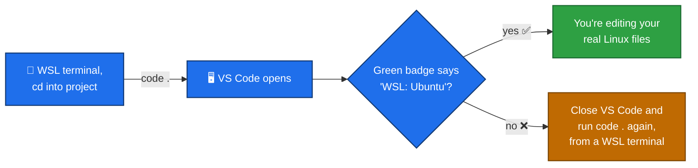

# VS Code with WSL

## The problem

VS Code is a Windows program. Your project's files, if you're working in WSL, actually live in the Linux filesystem (remember `/mnt/d/...` from the [WSL mini-course](../WSL/01-what-is-wsl.md)). If you open VS Code the "normal" Windows way and browse to your project, it *can* work, but you lose some of the benefits of being in a proper Linux environment — and it's easy to end up confused about which "copy" of a file you're actually editing.

The fix: open VS Code **in WSL mode**, so it connects directly to your Linux files and runs its tools (like its terminal) inside WSL too.

## How to open VS Code correctly

1. Open a WSL terminal (see the WSL mini-course if you need a reminder).
2. `cd` into your project folder.
3. Run:

```bash
code .
```

This launches VS Code already connected to WSL, sitting in that exact folder.

## How to check it worked

Look at the **bottom-left corner** of the VS Code window. You should see a small green badge that says something like:

```
><  WSL: Ubuntu
```



If that badge is **missing**, VS Code most likely opened a separate Windows-side view instead of your real WSL project — close the window and re-run `code .` from your WSL terminal.

## Why this matters

Once VS Code is connected this way:

- **Every file you edit** is the real file on your Linux filesystem — no separate "Windows copy" to get confused about.
- **VS Code's own integrated terminal** (`` Ctrl+` ``) opens already as a WSL terminal, in the right folder — you don't need to open a separate Windows Terminal window at all once you're inside VS Code.
- Any extensions that need to run tools (checking your code, running programs, etc.) run them inside WSL, matching how the project is actually meant to be used.

**Next:** [Exercises](exercises.md)
