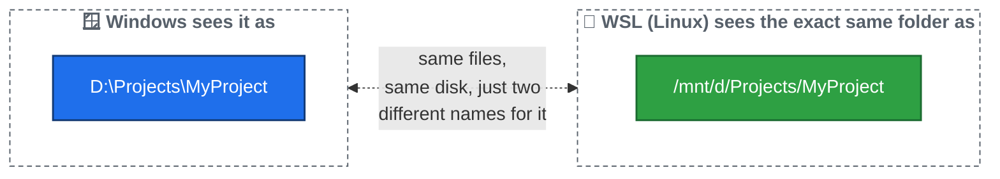

# What is WSL?

## The problem WSL solves

Your computer runs **Windows**. But most programming tools and tutorials are built assuming a **Linux** environment — Linux is what almost all real-world servers, and most professional developer setups, actually run.

**WSL** stands for **Windows Subsystem for Linux**. It's a real Linux environment that runs *inside* your Windows computer. You get the best of both: your normal Windows desktop, apps, and files — plus a genuine Linux command line whenever you need one.

## Windows Terminal and WSL tabs

**Windows Terminal** is just the app window you type commands into. Inside it, you can open different kinds of tabs:

- A plain **Windows tab** (PowerShell or Command Prompt) — this talks to Windows directly.
- A **WSL tab** (usually labeled with a Linux distribution name, commonly **Ubuntu**) — this talks to your Linux environment.

To open a WSL tab: open **Windows Terminal**, click the small **∨** arrow next to the `+` (new tab) button, and choose your Linux distribution from the list.

## How to tell if you're in the right place

A WSL terminal prompt usually looks like this:

```
yourname@COMPUTERNAME:~$
```

A plain Windows PowerShell prompt looks quite different, usually starting with something like:

```
PS C:\Users\YourName>
```

If you ever see a `PS ...>` prompt when you meant to be working in Linux, close that tab and open a WSL one instead.

## The most important idea: two names for the same files

Your computer's hard drives (like `C:` or `D:` in Windows) are visible from *inside* WSL too — just written differently. This trips up almost everyone at first, so read this twice:

| In Windows, you'd write... | In WSL (Linux), the same folder is... |
|---|---|
| `D:\Projects\MyProject` | `/mnt/d/Projects/MyProject` |
| `C:\Users\YourName\Documents` | `/mnt/c/Users/YourName/Documents` |

The pattern: `D:\` becomes `/mnt/d/`, `C:\` becomes `/mnt/c/`, and every `\` becomes a `/`.



This matters constantly: any time you're told to work with a project folder, you'll need to know both its Windows path and its WSL path, and be able to convert between them in your head.

**Next:** [02 — Basic Linux Commands](02-linux-commands.md)
