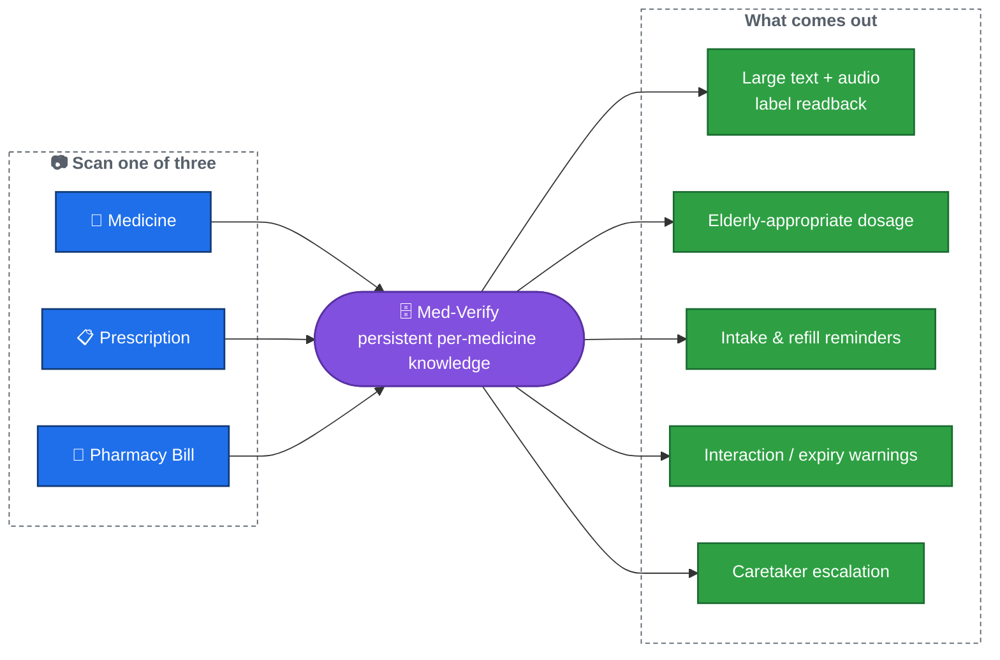
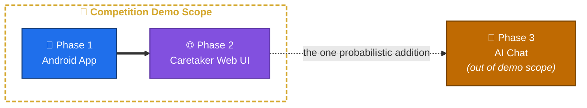

# Med-Verify

Med-Verify scans medicines, prescriptions, and pharmacy bills to help patients — especially elderly users — understand what they're taking, how much of it, and when.

It reads what's printed on a medicine's packaging back to the user in large text and audio, in their own local language; extracts dosage schedules from prescriptions and reminds the user when to take each dose; and tracks pharmacy bills to remind them to refill before running out. A caretaker can supervise all of it from a separate web dashboard.

## What it does

Every scan is exactly one of three independent input types — there's no combined input, and none of them need to happen in any particular order:

| Scan | What happens |
|---|---|
| **Medicine** | Identifies the medicine by its chemical/active ingredient (so different brands of the same drug — e.g. Paracetamol, Calpol, Dolo — are recognized as equivalent), reads the label back in large text and translated audio, and suggests an elderly-appropriate dosage. |
| **Prescription** | Extracts the dosage, frequency, and course duration the doctor wrote, and sets up intake reminders that end automatically when the course does. |
| **Pharmacy Bill** | Extracts the medicine and quantity purchased, and — combined with whatever dosage information is known — sets up a refill reminder before the supply runs out. |

The app remembers everything it learns per medicine, across separate scans, and fills in gaps as more information becomes available — e.g. a bill scanned before its matching prescription still gets a best-effort refill reminder, which is automatically corrected once the prescription is scanned later, even if it was purchased under a different brand name.

**Safety checks run automatically on every scan**: duplicate/interacting medicines are flagged, an expired medicine never gets a dosage suggestion (only a warning to replace it), and a caretaker is escalated to — by SMS and a real-time dashboard alert — if scheduled doses are repeatedly missed.

## Who it's for

- **The elderly patient** is the only day-to-day user, and is kept out of every piece of complexity that isn't the scan itself: no login, no settings, no manual data entry, and no denser "advanced" screen to accidentally wander into.
- **A caretaker** (family member) performs one-time setup — creating the account, scanning the patient's existing prescriptions/bills, registering an emergency contact — and can be linked to multiple elderly users from a single account (e.g. one caretaker looking after both parents).
- Anything the system can't confidently read, or any dosage/reminder that needs a human check, is handled entirely on the caretaker's side — never by asking the elderly user to type something in.

## Phases

| Phase | Contains | Notes |
|---|---|---|
| **Phase 1** | The Android app: all three scan types, dosage suggestions, intake/refill reminders, safety checks, SMS escalation. | Fully deterministic and scripted. |
| **Phase 2** | The caretaker web dashboard: multi-patient linking, real-time escalation alerts, and reviewing/overriding anything the app couldn't resolve or got wrong. | Also fully deterministic — built and demoed together with Phase 1. |
| **Phase 3** | An AI chat box for follow-up questions, prioritizing Indian-language-first models (e.g. Sarvam AI) over generic Western LLMs. | The only probabilistic piece in the system — deliberately kept out of the Phase 1/2 demo scope for that reason. |

## Repository structure

Requirements and architecture are fully specified; implementation hasn't started.

- **[Requirements/](Requirements/README.md)** — the full, approved requirement set (REQ-00 through REQ-17) — what the app must do, and why.
- **[Arch/](Arch/README.md)** — the full, approved architecture — client/backend/data-layer design, entity model, and every key flow as a diagram.
- **[Design/](Design/README.md)** — UI/UX design, split into `Android/`, `WebUI/`, `Backend/`, and `Interop/` (the frontend↔backend JSON contract) — not yet started.
- **[Implementation/](Implementation/README.md)** — source code, mirroring the same `Android/`, `WebUI/`, `Backend/`, `Interop/` split (each of the first three also has its own `config/`) — not yet started.
- **[Test/](Test/README.md)** — test plans and test code (not yet started).
- **[Knowledge/](Knowledge/README.md)** — beginner-friendly guides to WSL, VS Code, and Git/GitHub, written for student contributors new to these tools.
- `.claude/` — Claude Code project-local config.
